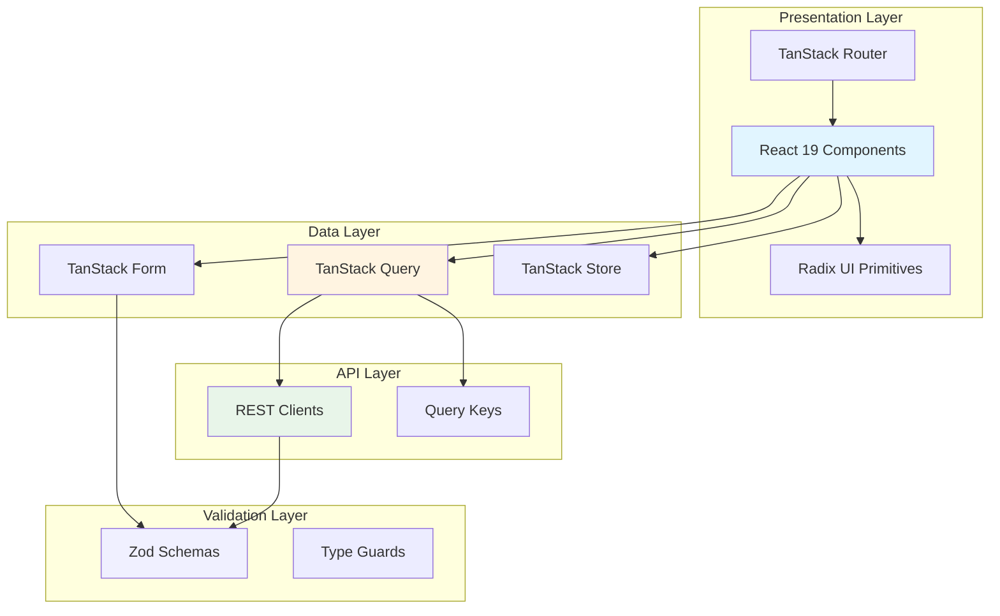

# ADR-013: Frontend Architecture Modernization and Best Practices

## Status
**Proposed** - *Date: 2025-01-26*

> **Status Guide:**
> - **Proposed**: Under discussion, not yet decided
> - **Accepted**: Approved and in effect
> - **Deprecated**: No longer recommended but still in use
> - **Superseded**: Replaced by ADR-YYY (reference the superseding ADR)

---

## Context

### Background
The web/ project currently uses modern technologies including React 19, TanStack Router v1.132, TanStack Query v5.66, Tailwind CSS v4, and other cutting-edge libraries. While the foundation is solid, there are opportunities to adopt emerging best practices and architectural patterns that have become standard in 2025. These improvements will enhance performance, developer experience, type safety, and maintainability.

The current stack represents a significant investment in modern tooling, but the ecosystem continues to evolve rapidly. React 19 introduced new patterns around Server Components conceptually (though we're client-side), improved use hooks, and better concurrent rendering support. TanStack Router has matured with improved type safety and data loading patterns. Tailwind CSS v4 brings performance improvements and better developer ergonomics.

### Current State
**Technology Stack:**
- **React**: 19.0.0 (latest stable)
- **TanStack Router**: 1.132.0 with file-based routing
- **TanStack Query**: 5.66.5 for data fetching
- **TanStack Form**: 1.0.0 for form management
- **TanStack Store**: 0.7.0 for state management
- **Tailwind CSS**: 4.0.6 with Vite plugin
- **TypeScript**: 5.7.2 (latest)
- **Vite**: 7.1.7
- **Biome**: 1.9.4 for linting/formatting
- **Vitest**: 3.0.5 for testing
- **i18next**: 25.5.3 for internationalization
- **Radix UI**: Latest versions for accessible components
- **Zod**: 3.24.2 for runtime validation

**Current Strengths:**
- Feature-based architecture with clear separation (`src/features/`, `src/components/`, `src/lib/`)
- TypeScript path aliases configured
- File-based routing with TanStack Router
- Modern build tooling (Vite)
- Biome for fast linting/formatting
- Testing infrastructure with Vitest

**Current Gaps:**
- Limited use of React 19's new hooks and patterns (useActionState, useOptimistic, use)
- TanStack Query integration could leverage more advanced patterns (optimistic updates, infinite queries)
- Form management could be more standardized with TanStack Form
- Type safety could be enhanced with better Zod integration
- Error boundaries and suspense boundaries not consistently implemented
- Performance optimizations (code splitting, lazy loading) not fully utilized
- Accessibility patterns not consistently applied across components
- Testing strategy could be more comprehensive

### Requirements

- **Immediate**: 
  - Leverage React 19 features for better UX and performance
  - Standardize data fetching patterns with TanStack Query best practices
  - Improve type safety across the application
  - Establish consistent error handling and loading states
  
- **Future**: 
  - Prepare for potential Server Components adoption if backend requirements change
  - Support for advanced caching strategies
  - Progressive enhancement capabilities
  - Micro-frontend readiness if scaling requires it
  
- **Always**: 
  - Maintain developer experience and productivity
  - Ensure accessibility (WCAG 2.1 AA minimum)
  - Performance budget compliance (< 3s LCP, < 100ms FID, < 0.1 CLS)
  - Type safety without excessive complexity

### Constraints

- **Technical**: 
  - Must remain a client-side SPA (no server-side rendering required currently)
  - Build output must be deployable as static files
  - Bundle size should not increase significantly
  - Existing feature functionality must not break
  
- **Business**: 
  - Changes must be incremental (no "big bang" rewrites)
  - No disruption to ongoing development
  - ROI must be clear (improved metrics, reduced bugs, faster development)
  
- **Organizational**: 
  - Small team - patterns must be learnable quickly
  - Documentation must be comprehensive
  - Migration path must be well-defined

---

## Decision

**We will adopt a comprehensive set of modern architectural patterns and best practices that leverage the latest capabilities of our tech stack while maintaining backward compatibility and incremental adoption.**

This decision encompasses eight key improvement areas:

1. **React 19 Patterns**: Adopt new concurrent features and hooks
2. **Advanced TanStack Query Patterns**: Implement optimistic updates, prefetching, and advanced caching
3. **Form Management Standardization**: Use TanStack Form with Zod validation
4. **Enhanced Type Safety**: Strengthen type definitions and runtime validation
5. **Error Boundary Strategy**: Implement comprehensive error handling
6. **Performance Optimization**: Code splitting, lazy loading, and bundle optimization
7. **Accessibility-First Components**: WCAG 2.1 AA compliance across all features
8. **Testing Strategy Evolution**: Comprehensive unit, integration, and E2E testing

### Architectural Approach

#### 1. React 19 Patterns and Hooks

**Description**: Leverage React 19's new capabilities for improved user experience and performance.

**Key Features to Adopt:**
- **`use` hook**: For reading promises and context in cleaner ways
- **`useActionState`**: Replace form submission patterns with React 19's action state hook
- **`useOptimistic`**: Immediate UI updates for better perceived performance
- **`useFormStatus`**: Better form loading states
- **Improved `useTransition`**: Better concurrent rendering support
- **Enhanced `useDeferredValue`**: Optimize expensive renders

**Implementation:**
```typescript
// Example: Modern form submission with useActionState
import { useActionState } from 'react'

function LoginForm() {
  const [state, action, isPending] = useActionState(
    async (prevState, formData) => {
      try {
        const result = await loginUser(formData)
        return { success: true, data: result }
      } catch (error) {
        return { success: false, error: error.message }
      }
    },
    { success: false }
  )

  return (
    <form action={action}>
      {state.error && <Error message={state.error} />}
      <input name="email" disabled={isPending} />
      <button disabled={isPending}>
        {isPending ? 'Logging in...' : 'Login'}
      </button>
    </form>
  )
}

// Example: Optimistic updates
import { useOptimistic } from 'react'

function TodoList({ todos, onAdd }) {
  const [optimisticTodos, addOptimisticTodo] = useOptimistic(
    todos,
    (state, newTodo) => [...state, { ...newTodo, pending: true }]
  )

  async function handleAdd(formData) {
    const newTodo = { id: crypto.randomUUID(), text: formData.get('text') }
    addOptimisticTodo(newTodo)
    await onAdd(newTodo)
  }

  return (
    <ul>
      {optimisticTodos.map(todo => (
        <li key={todo.id} className={todo.pending ? 'opacity-50' : ''}>
          {todo.text}
        </li>
      ))}
    </ul>
  )
}
```

**Rationale**: React 19 hooks provide better patterns for common scenarios like form submission and optimistic updates, resulting in cleaner code and better UX.

#### 2. Advanced TanStack Query Patterns

**Description**: Implement sophisticated data fetching, caching, and synchronization patterns.

**Best Practices to Adopt:**

**a) Query Key Factories**
```typescript
// lib/queryKeys.ts
export const queryKeys = {
  auth: {
    all: ['auth'] as const,
    session: () => [...queryKeys.auth.all, 'session'] as const,
    user: (id: string) => [...queryKeys.auth.all, 'user', id] as const,
  },
  twofa: {
    all: ['twofa'] as const,
    settings: () => [...queryKeys.twofa.all, 'settings'] as const,
    trustedDevices: () => [...queryKeys.twofa.all, 'trusted-devices'] as const,
  },
} as const
```

**b) Optimistic Updates with Rollback**
```typescript
// features/auth/hooks/useUpdateProfile.ts
import { useMutation, useQueryClient } from '@tanstack/react-query'
import { queryKeys } from '@/lib/queryKeys'

export function useUpdateProfile() {
  const queryClient = useQueryClient()

  return useMutation({
    mutationFn: updateProfileApi,
    onMutate: async (newProfile) => {
      // Cancel outgoing refetches
      await queryClient.cancelQueries({ queryKey: queryKeys.auth.session() })

      // Snapshot previous value
      const previousProfile = queryClient.getQueryData(queryKeys.auth.session())

      // Optimistically update
      queryClient.setQueryData(queryKeys.auth.session(), (old) => ({
        ...old,
        ...newProfile,
      }))

      return { previousProfile }
    },
    onError: (err, newProfile, context) => {
      // Rollback on error
      queryClient.setQueryData(
        queryKeys.auth.session(),
        context.previousProfile
      )
    },
    onSettled: () => {
      // Refetch to ensure consistency
      queryClient.invalidateQueries({ queryKey: queryKeys.auth.session() })
    },
  })
}
```

**c) Prefetching and Parallel Queries**
```typescript
// Prefetch on hover for instant navigation
const prefetchUser = () => {
  queryClient.prefetchQuery({
    queryKey: queryKeys.auth.user(userId),
    queryFn: () => fetchUser(userId),
    staleTime: 10000,
  })
}

// Parallel queries with dependent data
const { data: user } = useQuery({
  queryKey: queryKeys.auth.session(),
  queryFn: fetchSession,
})

const { data: settings } = useQuery({
  queryKey: ['settings', user?.id],
  queryFn: () => fetchSettings(user.id),
  enabled: !!user?.id, // Only run when user is available
})
```

**d) Infinite Queries for Pagination**
```typescript
const { data, fetchNextPage, hasNextPage, isFetchingNextPage } =
  useInfiniteQuery({
    queryKey: ['notifications'],
    queryFn: ({ pageParam = 0 }) => fetchNotifications(pageParam),
    getNextPageParam: (lastPage) => lastPage.nextCursor,
    initialPageParam: 0,
  })
```

**Rationale**: Advanced TanStack Query patterns provide better UX through optimistic updates, reduce unnecessary network requests through smart prefetching, and improve performance with proper caching strategies.

#### 3. Form Management with TanStack Form + Zod

**Description**: Standardize form handling across the application using TanStack Form integrated with Zod for runtime validation.

**Implementation Pattern:**
```typescript
// features/auth/schemas/loginSchema.ts
import { z } from 'zod'

export const loginSchema = z.object({
  email: z.string().email('Invalid email address'),
  password: z.string().min(8, 'Password must be at least 8 characters'),
  rememberMe: z.boolean().optional(),
})

export type LoginFormData = z.infer<typeof loginSchema>

// features/auth/components/LoginForm.tsx
import { useForm } from '@tanstack/react-form'
import { zodValidator } from '@tanstack/zod-form-adapter'
import { loginSchema } from '../schemas/loginSchema'

export function LoginForm() {
  const form = useForm({
    defaultValues: {
      email: '',
      password: '',
      rememberMe: false,
    },
    onSubmit: async ({ value }) => {
      await loginMutation.mutateAsync(value)
    },
    validators: {
      onChange: loginSchema,
    },
    validatorAdapter: zodValidator,
  })

  return (
    <form
      onSubmit={(e) => {
        e.preventDefault()
        e.stopPropagation()
        form.handleSubmit()
      }}
    >
      <form.Field
        name="email"
        children={(field) => (
          <div>
            <label htmlFor={field.name}>Email</label>
            <input
              id={field.name}
              name={field.name}
              value={field.state.value}
              onBlur={field.handleBlur}
              onChange={(e) => field.handleChange(e.target.value)}
            />
            {field.state.meta.errors && (
              <span className="text-red-600">
                {field.state.meta.errors.join(', ')}
              </span>
            )}
          </div>
        )}
      />
      {/* Additional fields */}
      <button type="submit" disabled={form.state.isSubmitting}>
        {form.state.isSubmitting ? 'Logging in...' : 'Login'}
      </button>
    </form>
  )
}
```

**Benefits:**
- Type-safe forms from schema to component
- Runtime validation with Zod
- Automatic error handling
- Field-level validation
- Better developer experience

**Rationale**: TanStack Form provides better type safety and developer experience compared to manual form handling, while Zod ensures runtime validation matches TypeScript types.

#### 4. Enhanced Type Safety

**Description**: Strengthen type definitions across API boundaries, state management, and component interfaces.

**Key Improvements:**

**a) API Response Types with Branded Types**
```typescript
// lib/types/branded.ts
declare const __brand: unique symbol
type Brand<B> = { [__brand]: B }
export type Branded<T, B> = T & Brand<B>

// Domain types
export type UserId = Branded<string, 'UserId'>
export type Email = Branded<string, 'Email'>
export type AuthToken = Branded<string, 'AuthToken'>

// Type guards
export function isEmail(value: string): value is Email {
  return /^[^\s@]+@[^\s@]+\.[^\s@]+$/.test(value)
}

// Usage
const userId: UserId = 'user_123' as UserId // Explicit casting required
const email: Email = isEmail('test@test.com') 
  ? 'test@test.com' as Email 
  : throw new Error('Invalid email')
```

**b) Discriminated Unions for API Responses**
```typescript
// lib/types/api.ts
export type ApiResponse<T> =
  | { success: true; data: T }
  | { success: false; error: ApiError }

export type ApiError = {
  code: string
  message: string
  details?: Record<string, unknown>
}

// Type-safe response handling
async function fetchUser(id: UserId): Promise<ApiResponse<User>> {
  // Implementation
}

// Usage with exhaustive pattern matching
const response = await fetchUser(userId)
if (response.success) {
  console.log(response.data.name) // TypeScript knows data exists
} else {
  console.error(response.error.message) // TypeScript knows error exists
}
```

**c) Const Assertions for Configuration**
```typescript
// lib/config/features.ts
export const FEATURES = {
  TWO_FACTOR_AUTH: {
    enabled: true,
    methods: ['email', 'sms', 'totp'] as const,
  },
  MAGIC_LINK: {
    enabled: true,
    expiryMinutes: 15,
  },
} as const

type FeatureConfig = typeof FEATURES
type TwoFactorMethod = (typeof FEATURES.TWO_FACTOR_AUTH.methods)[number]
// Type is: 'email' | 'sms' | 'totp'
```

**Rationale**: Enhanced type safety prevents runtime errors, improves autocomplete, and makes refactoring safer.

#### 5. Comprehensive Error Boundary Strategy

**Description**: Implement error boundaries at multiple levels with graceful degradation.

**Error Boundary Hierarchy:**
```typescript
// components/boundaries/RootErrorBoundary.tsx
import { ErrorBoundary } from 'react-error-boundary'

export function RootErrorBoundary({ children }: { children: React.ReactNode }) {
  return (
    <ErrorBoundary
      fallbackRender={({ error, resetErrorBoundary }) => (
        <div className="min-h-screen flex items-center justify-center">
          <div className="text-center">
            <h1 className="text-2xl font-bold mb-4">Something went wrong</h1>
            <p className="text-gray-600 mb-4">{error.message}</p>
            <button
              onClick={resetErrorBoundary}
              className="px-4 py-2 bg-blue-600 text-white rounded"
            >
              Try again
            </button>
          </div>
        </div>
      )}
      onError={(error, errorInfo) => {
        // Log to error tracking service
        console.error('Root error:', error, errorInfo)
      }}
    >
      {children}
    </ErrorBoundary>
  )
}

// components/boundaries/FeatureErrorBoundary.tsx
export function FeatureErrorBoundary({
  children,
  featureName,
}: {
  children: React.ReactNode
  featureName: string
}) {
  return (
    <ErrorBoundary
      fallbackRender={({ error, resetErrorBoundary }) => (
        <div className="p-4 border border-red-300 bg-red-50 rounded">
          <h2 className="font-semibold mb-2">
            Error in {featureName}
          </h2>
          <p className="text-sm text-gray-700 mb-3">{error.message}</p>
          <button
            onClick={resetErrorBoundary}
            className="text-sm px-3 py-1 bg-red-600 text-white rounded"
          >
            Retry
          </button>
        </div>
      )}
      onReset={() => {
        // Reset feature state
      }}
    >
      {children}
    </ErrorBoundary>
  )
}

// Usage in routes
export const Route = createFileRoute('/dashboard')({
  component: () => (
    <FeatureErrorBoundary featureName="Dashboard">
      <Dashboard />
    </FeatureErrorBoundary>
  ),
  errorComponent: ({ error }) => <RouteError error={error} />,
})
```

**TanStack Query Error Handling:**
```typescript
// lib/queryClient.ts
import { QueryClient } from '@tanstack/react-query'

export const queryClient = new QueryClient({
  defaultOptions: {
    queries: {
      retry: (failureCount, error) => {
        // Don't retry on 4xx errors
        if (error?.response?.status >= 400 && error?.response?.status < 500) {
          return false
        }
        return failureCount < 3
      },
      staleTime: 5000,
      refetchOnWindowFocus: false,
    },
    mutations: {
      onError: (error) => {
        // Global error handling for mutations
        console.error('Mutation error:', error)
        // Show toast notification
      },
    },
  },
})
```

**Rationale**: Comprehensive error boundaries prevent full application crashes and provide better user experience when errors occur.

#### 6. Performance Optimization Strategy

**Description**: Implement code splitting, lazy loading, and performance monitoring.

**Key Optimizations:**

**a) Route-Based Code Splitting**
```typescript
// Already implemented with TanStack Router file-based routing
// Each route is automatically code-split

// For heavy components within routes:
import { lazy, Suspense } from 'react'

const HeavyChart = lazy(() => import('../components/HeavyChart'))

export function Dashboard() {
  return (
    <Suspense fallback={<ChartSkeleton />}>
      <HeavyChart data={data} />
    </Suspense>
  )
}
```

**b) Component-Level Lazy Loading**
```typescript
// features/auth/components/index.ts
export { LoginCard } from './LoginCard'
export { SignupCard } from './SignupCard'

// Lazy load less critical components
export const AuthDevtools = lazy(() =>
  import('./AuthDevtools').then((m) => ({ default: m.AuthDevtools }))
)
```

**c) Image Optimization**
```typescript
// components/ui/OptimizedImage.tsx
export function OptimizedImage({
  src,
  alt,
  width,
  height,
  priority = false,
}: ImageProps) {
  return (
    
  )
}
```

**d) Performance Monitoring**
```typescript
// lib/performance/monitoring.ts
import { onCLS, onFID, onLCP, onFCP, onTTFB } from 'web-vitals'

export function initPerformanceMonitoring() {
  onCLS(console.log)
  onFID(console.log)
  onLCP(console.log)
  onFCP(console.log)
  onTTFB(console.log)
  
  // Report to analytics service
}

// Usage in main.tsx
initPerformanceMonitoring()
```

**e) Bundle Analysis**
```json
// package.json
{
  "scripts": {
    "build:analyze": "vite build && vite-bundle-visualizer"
  }
}
```

**Rationale**: Performance optimizations improve user experience, reduce bounce rates, and improve SEO rankings.

#### 7. Accessibility-First Component Development

**Description**: Ensure all components meet WCAG 2.1 AA standards with proper ARIA attributes and keyboard navigation.

**Best Practices:**

**a) Semantic HTML First**
```typescript
// ❌ Bad
<div onClick={handleClick}>Click me</div>

// ✅ Good
<button onClick={handleClick}>Click me</button>
```

**b) ARIA Labels and Roles**
```typescript
// components/ui/Dialog.tsx
export function Dialog({ title, children, onClose }: DialogProps) {
  return (
    <div
      role="dialog"
      aria-modal="true"
      aria-labelledby="dialog-title"
      className="fixed inset-0 z-50"
    >
      <div className="fixed inset-0 bg-black/50" onClick={onClose} />
      <div className="fixed inset-0 flex items-center justify-center p-4">
        <div className="bg-white rounded-lg shadow-xl max-w-md w-full">
          <h2 id="dialog-title" className="text-xl font-bold p-4">
            {title}
          </h2>
          {children}
        </div>
      </div>
    </div>
  )
}
```

**c) Keyboard Navigation**
```typescript
// components/ui/Menu.tsx
export function Menu({ items }: MenuProps) {
  const [focusedIndex, setFocusedIndex] = useState(0)

  const handleKeyDown = (e: KeyboardEvent) => {
    switch (e.key) {
      case 'ArrowDown':
        e.preventDefault()
        setFocusedIndex((i) => (i + 1) % items.length)
        break
      case 'ArrowUp':
        e.preventDefault()
        setFocusedIndex((i) => (i - 1 + items.length) % items.length)
        break
      case 'Enter':
      case ' ':
        e.preventDefault()
        items[focusedIndex].onClick()
        break
      case 'Escape':
        closeMenu()
        break
    }
  }

  return (
    <div role="menu" onKeyDown={handleKeyDown}>
      {items.map((item, index) => (
        <button
          key={item.id}
          role="menuitem"
          tabIndex={index === focusedIndex ? 0 : -1}
          onClick={item.onClick}
        >
          {item.label}
        </button>
      ))}
    </div>
  )
}
```

**d) Focus Management**
```typescript
// hooks/useFocusTrap.ts
import { useEffect, useRef } from 'react'

export function useFocusTrap(isActive: boolean) {
  const containerRef = useRef<HTMLDivElement>(null)

  useEffect(() => {
    if (!isActive) return

    const container = containerRef.current
    if (!container) return

    const focusableElements = container.querySelectorAll(
      'button, [href], input, select, textarea, [tabindex]:not([tabindex="-1"])'
    )

    const firstElement = focusableElements[0] as HTMLElement
    const lastElement = focusableElements[focusableElements.length - 1] as HTMLElement

    firstElement?.focus()

    const handleTab = (e: KeyboardEvent) => {
      if (e.key !== 'Tab') return

      if (e.shiftKey) {
        if (document.activeElement === firstElement) {
          lastElement?.focus()
          e.preventDefault()
        }
      } else {
        if (document.activeElement === lastElement) {
          firstElement?.focus()
          e.preventDefault()
        }
      }
    }

    document.addEventListener('keydown', handleTab)
    return () => document.removeEventListener('keydown', handleTab)
  }, [isActive])

  return containerRef
}
```

**e) Color Contrast and Visual Indicators**
```typescript
// tailwind.config.js - Ensure sufficient contrast ratios
export default {
  theme: {
    extend: {
      colors: {
        // All colors should meet WCAG AA contrast requirements (4.5:1 for normal text)
        primary: {
          DEFAULT: '#2563eb', // Blue with sufficient contrast
          dark: '#1e40af',
        },
      },
    },
  },
}
```

**Rationale**: Accessibility is both legally required and morally correct. It also improves usability for all users, not just those with disabilities.

#### 8. Enhanced Testing Strategy

**Description**: Comprehensive testing approach covering unit, integration, and E2E tests.

**Testing Patterns:**

**a) Component Testing with Testing Library**
```typescript
// features/auth/components/__tests__/LoginCard.test.tsx
import { render, screen, waitFor } from '@testing-library/react'
import userEvent from '@testing-library/user-event'
import { LoginCard } from '../LoginCard'
import { QueryClient, QueryClientProvider } from '@tanstack/react-query'

describe('LoginCard', () => {
  it('should submit form with valid credentials', async () => {
    const user = userEvent.setup()
    const queryClient = new QueryClient()

    render(
      <QueryClientProvider client={queryClient}>
        <LoginCard />
      </QueryClientProvider>
    )

    await user.type(screen.getByLabelText(/email/i), 'test@example.com')
    await user.type(screen.getByLabelText(/password/i), 'password123')
    await user.click(screen.getByRole('button', { name: /login/i }))

    await waitFor(() => {
      expect(screen.getByText(/logged in/i)).toBeInTheDocument()
    })
  })

  it('should show validation errors for invalid email', async () => {
    const user = userEvent.setup()
    render(<LoginCard />)

    await user.type(screen.getByLabelText(/email/i), 'invalid-email')
    await user.click(screen.getByRole('button', { name: /login/i }))

    expect(screen.getByText(/invalid email/i)).toBeInTheDocument()
  })
})
```

**b) Hook Testing**
```typescript
// features/auth/hooks/__tests__/useLogin.test.ts
import { renderHook, waitFor } from '@testing-library/react'
import { useLogin } from '../useLogin'
import { QueryClient, QueryClientProvider } from '@tanstack/react-query'

describe('useLogin', () => {
  it('should handle successful login', async () => {
    const queryClient = new QueryClient()
    const wrapper = ({ children }) => (
      <QueryClientProvider client={queryClient}>
        {children}
      </QueryClientProvider>
    )

    const { result } = renderHook(() => useLogin(), { wrapper })

    result.current.mutate({
      email: 'test@example.com',
      password: 'password123',
    })

    await waitFor(() => {
      expect(result.current.isSuccess).toBe(true)
    })
  })
})
```

**c) Integration Testing**
```typescript
// __tests__/auth-flow.test.tsx
import { render, screen, waitFor } from '@testing-library/react'
import userEvent from '@testing-library/user-event'
import { App } from '../App'

describe('Authentication Flow', () => {
  it('should complete full login flow', async () => {
    const user = userEvent.setup()
    render(<App />)

    // Navigate to login
    await user.click(screen.getByRole('link', { name: /login/i }))

    // Fill form
    await user.type(screen.getByLabelText(/email/i), 'test@example.com')
    await user.type(screen.getByLabelText(/password/i), 'password123')

    // Submit
    await user.click(screen.getByRole('button', { name: /login/i }))

    // Verify redirect to dashboard
    await waitFor(() => {
      expect(screen.getByText(/dashboard/i)).toBeInTheDocument()
    })
  })
})
```

**Rationale**: Comprehensive testing prevents regressions, documents expected behavior, and enables confident refactoring.

### Technology Selection

| Component | Technology | Version | Justification |
|-----------|-----------|---------|---------------|
| UI Framework | React | 19.0.0 | Latest stable with concurrent features |
| Routing | TanStack Router | 1.132.0 | Type-safe routing with excellent DX |
| Data Fetching | TanStack Query | 5.66.5 | Best-in-class data synchronization |
| Form Management | TanStack Form | 1.0.0 | Type-safe forms with great DX |
| State Management | TanStack Store | 0.7.0 | Simple, type-safe state management |
| Styling | Tailwind CSS | 4.0.6 | Utility-first with excellent performance |
| Validation | Zod | 3.24.2 | Runtime type validation |
| Component Library | Radix UI | Latest | Accessible primitives |
| Build Tool | Vite | 7.1.7 | Fast builds and HMR |
| Linting | Biome | 1.9.4 | Fast linting and formatting |
| Testing | Vitest | 3.0.5 | Fast, Vite-native testing |
| i18n | i18next | 25.5.3 | Comprehensive internationalization |

### Implementation Plan

**Phase 1: Foundation (Weeks 1-2)**
- [ ] Create example components demonstrating new patterns
- [ ] Document React 19 hooks usage with examples
- [ ] Set up enhanced TypeScript configurations
- [ ] Implement error boundary hierarchy
- [ ] Add performance monitoring

**Phase 2: Data Layer (Weeks 3-4)**
- [ ] Implement query key factories
- [ ] Add optimistic update patterns to key mutations
- [ ] Set up prefetching strategies
- [ ] Enhance error handling in queries
- [ ] Document TanStack Query patterns

**Phase 3: Forms & Validation (Weeks 5-6)**
- [ ] Migrate critical forms to TanStack Form
- [ ] Create reusable form components
- [ ] Establish Zod schema patterns
- [ ] Document form patterns and best practices

**Phase 4: Accessibility & Testing (Weeks 7-8)**
- [ ] Audit existing components for accessibility
- [ ] Add ARIA attributes where needed
- [ ] Implement keyboard navigation
- [ ] Expand test coverage to 80%+
- [ ] Add integration tests for critical flows

**Phase 5: Performance (Weeks 9-10)**
- [ ] Implement lazy loading for heavy components
- [ ] Add bundle analysis to CI/CD
- [ ] Optimize images and assets
- [ ] Set up performance budgets
- [ ] Document performance best practices

---

## Alternatives Considered

### Alternative 1: Keep Current Patterns Without Modernization
**Description**: Continue with existing patterns without adopting new best practices.

**Pros:**
- No learning curve
- No migration effort
- No risk of breaking changes

**Cons:**
- Miss out on performance improvements
- Accumulate technical debt
- Harder to attract/retain developers familiar with modern patterns
- User experience falls behind competitors

**Why Rejected**: The ecosystem has evolved significantly. Not adopting modern patterns will make the codebase progressively harder to maintain and less competitive.

### Alternative 2: Full Rewrite with Next.js/Remix
**Description**: Migrate to a full-stack framework like Next.js or Remix.

**Pros:**
- Server-side rendering capabilities
- Better SEO potential
- More integrated ecosystem
- Potential performance benefits

**Cons:**
- Massive effort required (3-6 months)
- Requires backend architecture changes
- Team needs to learn new paradigms
- Current SPA architecture works fine for use case
- High risk of introducing bugs

**Why Rejected**: The current SPA architecture meets requirements. A full rewrite would be expensive and risky without clear business justification.

### Alternative 3: Minimal Adoption (Cherry-Pick Features)
**Description**: Only adopt a few select improvements rather than comprehensive modernization.

**Pros:**
- Lower upfront effort
- Less disruption
- Easier to get team buy-in

**Cons:**
- Inconsistent patterns across codebase
- Misses synergies between improvements
- Incomplete developer experience improvements
- Technical debt continues to accumulate

**Why Rejected**: Piecemeal adoption creates inconsistency. A comprehensive but incremental approach provides better long-term value.

### Alternative 4: Wait for Libraries to Further Mature
**Description**: Delay adoption until libraries are "more mature" or "more stable."

**Pros:**
- Libraries might have fewer bugs
- More community resources available
- Clearer best practices

**Cons:**
- React 19, TanStack Router, etc. are already production-ready
- Competitive disadvantage from waiting
- Technical debt continues to grow
- "Perfect" timing never arrives

**Why Rejected**: The libraries we're using are mature and production-ready. Waiting provides no real benefit.

---

## Consequences

### Positive Consequences
- ✅ **Improved Performance**: Faster load times, better perceived performance through optimistic updates
- ✅ **Better Developer Experience**: Type safety, better tooling support, cleaner code patterns
- ✅ **Enhanced User Experience**: More responsive UI, better error handling, improved accessibility
- ✅ **Reduced Bugs**: Type safety and testing catch issues earlier
- ✅ **Future-Proof**: Aligned with ecosystem direction and modern best practices
- ✅ **Easier Onboarding**: Modern patterns are well-documented and easier to learn
- ✅ **Better Maintainability**: Consistent patterns reduce cognitive load
- ✅ **Accessibility Compliance**: Reduced legal risk and improved usability

### Negative Consequences
- ⚠️ **Learning Curve**: Team needs to learn new patterns and hooks
- ⚠️ **Migration Effort**: Existing code needs gradual migration (10-12 weeks estimated)
- ⚠️ **Temporary Inconsistency**: During migration, old and new patterns coexist
- ⚠️ **Documentation Burden**: Need to document patterns and best practices

### Risks and Mitigations

| Risk | Impact | Probability | Mitigation |
|------|--------|-------------|------------|
| Team resistance to learning new patterns | Medium | Medium | Provide examples, workshops, and mentoring |
| Breaking existing functionality during migration | High | Low | Comprehensive testing, incremental migration |
| Over-engineering simple features | Medium | Medium | Clear guidelines on when to apply advanced patterns |
| Performance degradation from new abstractions | Medium | Low | Performance monitoring and benchmarking |
| Accessibility implementation inconsistency | High | Medium | Component library with accessible primitives, audit tools |

---

## Implementation Details

### Architecture Diagram



### Example Project Structure with Best Practices

```
web/src/
├── routes/                          # TanStack Router file-based routes
│   ├── __root.tsx                   # Root with error boundary
│   ├── index.tsx                    # Home page
│   └── auth/
│       ├── login.tsx                # Lazy-loaded login page
│       └── signup.tsx
│
├── features/                        # Feature modules
│   ├── auth/
│   │   ├── index.ts                 # Public API
│   │   ├── components/
│   │   │   ├── LoginCard.tsx        # Accessible, form with TanStack Form
│   │   │   └── __tests__/
│   │   ├── hooks/
│   │   │   ├── useLogin.ts          # With optimistic updates
│   │   │   └── __tests__/
│   │   ├── api/
│   │   │   └── authClient.ts        # Type-safe API client
│   │   ├── schemas/
│   │   │   └── loginSchema.ts       # Zod validation schemas
│   │   └── types/
│   │       └── auth.types.ts        # Branded types
│   │
│   └── twofa/
│       └── (similar structure)
│
├── components/                      # Shared components
│   ├── ui/                          # Radix UI wrappers (accessible)
│   ├── boundaries/                  # Error boundaries
│   └── layouts/
│
├── lib/                            # Shared utilities
│   ├── queryKeys.ts                # Query key factories
│   ├── queryClient.ts              # Configured query client
│   ├── types/
│   │   ├── branded.ts              # Branded types
│   │   └── api.ts                  # API response types
│   └── performance/
│       └── monitoring.ts           # Performance monitoring
│
└── integrations/                   # Third-party integrations
```

---

## Testing Strategy

### Unit Tests
- Test all hooks with `@testing-library/react-hooks`
- Test utility functions in isolation
- Test Zod schemas validate correctly
- Achieve 80%+ code coverage

### Integration Tests
- Test complete user flows (login → dashboard)
- Test form submission with validation
- Test error boundary behavior
- Test accessibility with `jest-axe`

### Performance Tests
- Monitor Core Web Vitals (LCP, FID, CLS)
- Bundle size analysis on each PR
- Lighthouse CI for performance budgets
- Load testing for data-heavy views

### Accessibility Tests
- Automated testing with `jest-axe`
- Manual keyboard navigation testing
- Screen reader testing (NVDA, VoiceOver)
- Color contrast verification

---

## Documentation Requirements

- [ ] Create architecture overview document
- [ ] Document React 19 patterns with examples
- [ ] Create TanStack Query best practices guide
- [ ] Document form patterns and validation
- [ ] Create accessibility checklist for components
- [ ] Update contributing guide with new patterns
- [ ] Create migration guide for legacy code
- [ ] Add inline code examples for common patterns

---

## Monitoring and Observability

### Metrics to Track
- **Performance Metrics**: LCP, FID, CLS, TTFB tracked via Web Vitals
- **Bundle Size**: Track per-route bundle sizes
- **Error Rates**: Monitor error boundary triggers
- **Query Performance**: Track query success/failure rates and timings
- **Accessibility**: Track accessibility violations in development

### Alerts to Configure
- Alert if LCP > 2.5s
- Alert if bundle size increases > 20%
- Alert if error rate increases significantly
- Alert if accessibility violations detected

### Logging Requirements
- Log all error boundary catches
- Log performance metrics in production
- Log failed API requests with context
- Structured logging for easy searching

---

## Success Criteria

This decision will be considered successful when:

- [ ] All new features use React 19 hooks appropriately
- [ ] 80%+ of forms use TanStack Form with Zod validation
- [ ] All critical queries implement optimistic updates
- [ ] All components pass accessibility audits
- [ ] Test coverage reaches 80%+
- [ ] Core Web Vitals meet "Good" thresholds (LCP < 2.5s, FID < 100ms, CLS < 0.1)
- [ ] Bundle size remains stable or decreases
- [ ] Developer feedback is positive (survey after 3 months)

**Success Metrics:**
- **Performance**: LCP < 2.5s, FID < 100ms, CLS < 0.1
- **Accessibility**: Zero critical accessibility violations
- **Test Coverage**: 80%+ coverage for features
- **Bundle Size**: Main bundle < 300KB (gzipped)
- **Developer Productivity**: 25% reduction in time to implement new features

---

## Review Schedule

- **First Review**: 6 weeks after approval - Assess Phase 1-2 progress
- **Second Review**: 3 months after approval - Evaluate Phase 3-4 completion
- **Final Review**: 6 months after approval - Assess all improvements and ROI
- **Annual Review**: Yearly - Reassess patterns against ecosystem evolution

---

## Related ADRs

- [ADR-011: Frontend File Architecture](./ADR-011-FRONTEND-FILE-ARCHITECTURE.md) - Feature-based organization foundation
- [ADR-004: 2FA Frontend Implementation](./ADR-004-2FA-FRONTEND-IMPLEMENTATION.md) - Will benefit from form patterns
- Future: ADR on Performance Budgets and Monitoring
- Future: ADR on E2E Testing Strategy

---

## References

- [React 19 Release Notes](https://react.dev/blog/2024/12/05/react-19)
- [TanStack Router Documentation](https://tanstack.com/router/latest)
- [TanStack Query Best Practices](https://tanstack.com/query/latest/docs/framework/react/guides/best-practices)
- [TanStack Form Documentation](https://tanstack.com/form/latest)
- [Zod Documentation](https://zod.dev/)
- [Tailwind CSS v4 Documentation](https://tailwindcss.com/docs)
- [Web Vitals](https://web.dev/vitals/)
- [WCAG 2.1 Guidelines](https://www.w3.org/WAI/WCAG21/quickref/)
- [React Testing Library Best Practices](https://testing-library.com/docs/react-testing-library/intro/)
- [TypeScript Branded Types](https://egghead.io/blog/using-branded-types-in-typescript)
- [Bulletproof React Patterns](https://github.com/alan2207/bulletproof-react)

---

## Approval

| Role | Name | Date | Signature |
|------|------|------|-----------|
| Lead Developer | [TBD] | YYYY-MM-DD | Pending |
| Tech Lead | [TBD] | YYYY-MM-DD | Pending |
| Team Review | [TBD] | YYYY-MM-DD | Pending |

---

## Change History

| Date | Version | Author | Changes |
|------|---------|--------|---------|
| 2025-01-26 | 1.0 | GitHub Copilot CLI | Initial ADR creation |
