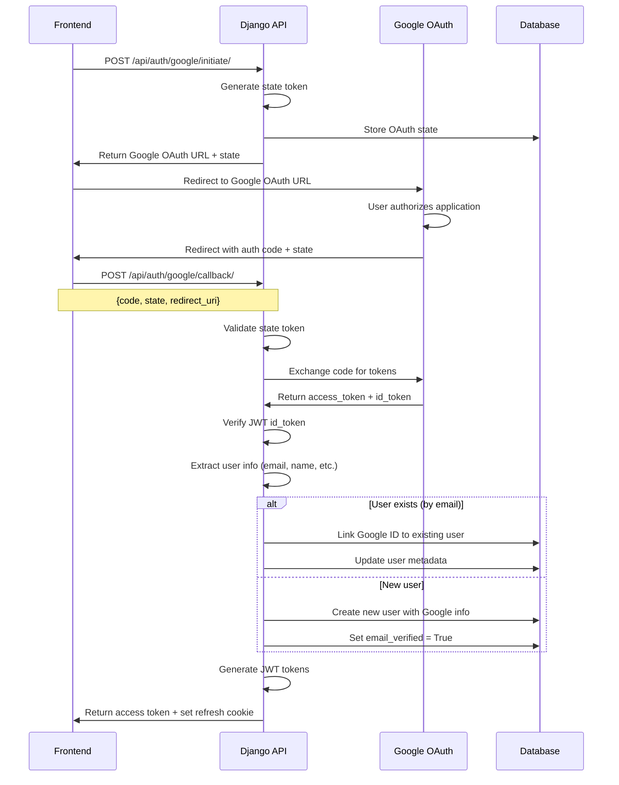

# Google OAuth Integration Architecture

## Overview
This document outlines the architecture for integrating Google OAuth authentication into the existing Django REST Framework + JWT authentication system, with intelligent account linking capabilities.

## Current Authentication Architecture

### ✅ Existing System Components
- **Django REST Framework** with JWT authentication (`djangorestframework-simplejwt`)
- **Custom User Model** with email, username, role, email_verified fields
- **JWT Token Management** with access tokens (30min) and refresh tokens (7 days)
- **HTTP-only Cookies** for secure refresh token storage
- **Redis Cache** for temporary token storage (email verification, password reset)
- **Email Verification** workflow with Celery background tasks

### 🔄 Current Authentication Flow
```
1. User signs up → Creates account with email/username/password
2. Email verification sent → User clicks link → Email marked as verified
3. User logs in → Returns JWT access token + sets refresh token cookie
4. Protected endpoints → Validate JWT access token
5. Token refresh → Use refresh token cookie to get new access token
```

## Google OAuth Integration Requirements

### Core Requirements
1. **Dual Sign-up Methods**: Users can create accounts manually OR via Google OAuth
2. **Automatic Account Linking**: Google sign-in automatically links to existing accounts by email
3. **Seamless Integration**: Google OAuth uses same JWT token system as manual accounts
4. **No Breaking Changes**: Existing manual authentication continues to work unchanged
5. **Email Verification**: Google-authenticated emails are automatically verified

### Account Linking Scenarios
1. **New User + Google**: Creates new account with Google info, email pre-verified
2. **Existing Verified User + Google**: Links Google to existing verified account (by email match)
3. **Existing Unverified User + Google**: **BLOCKED** - Prevents account takeover attacks
4. **Google First, Manual Later**: User signs up with Google, can later set password for manual login
5. **Manual First, Google Later**: User with verified manual account can link Google for convenience

### Email Verification Security Requirement
**Critical Security Policy**: Google OAuth linking is only allowed with email-verified accounts to prevent account takeover attacks where:
- Attacker creates unverified account with victim's email
- Victim attempts Google OAuth login
- System would incorrectly link to attacker's account

**Implementation**: Google OAuth will be blocked if an unverified manual account exists with the same email address.

## Proposed Architecture

### 1. Database Schema Changes

#### Enhanced User Model
```python
# users/models/user.py
class User(AbstractUser):
    # ... existing fields ...
    email = models.EmailField(unique=True)
    role = models.CharField(max_length=20, choices=UserRole.choices, default=UserRole.CIRCLE_MEMBER)
    email_verified = models.BooleanField(default=False)
    
    # New Google OAuth fields
    google_id = models.CharField(max_length=100, unique=True, null=True, blank=True)
    google_email = models.EmailField(null=True, blank=True)  # For tracking/debugging
    has_usable_password = models.BooleanField(default=True)  # Track if password is set
    auth_provider = models.CharField(max_length=20, default='manual')  # 'manual', 'google', 'hybrid'
    
    # Metadata
    google_linked_at = models.DateTimeField(null=True, blank=True)
    last_google_sync = models.DateTimeField(null=True, blank=True)
```

#### Google OAuth Session Tracking (Optional)
```python
# users/models/oauth.py
class GoogleOAuthState(models.Model):
    """Track OAuth state for security and debugging"""
    state_token = models.CharField(max_length=128, unique=True)
    user = models.ForeignKey(User, on_delete=models.CASCADE, null=True, blank=True)
    redirect_uri = models.URLField()
    created_at = models.DateTimeField(auto_now_add=True)
    used_at = models.DateTimeField(null=True, blank=True)
    ip_address = models.GenericIPAddressField()
```

### 2. Google OAuth Flow Architecture

#### OAuth 2.0 Authorization Code Flow


### 3. API Endpoint Design

#### New OAuth Endpoints
```python
# users/urls.py additions
path('auth/google/initiate/', GoogleOAuthInitiateView.as_view(), name='google-oauth-initiate'),
path('auth/google/callback/', GoogleOAuthCallbackView.as_view(), name='google-oauth-callback'),
path('auth/google/link/', GoogleOAuthLinkView.as_view(), name='google-oauth-link'),
path('auth/google/unlink/', GoogleOAuthUnlinkView.as_view(), name='google-oauth-unlink'),
```

#### Endpoint Specifications

##### 1. Initiate OAuth Flow
```
POST /api/auth/google/initiate/
Content-Type: application/json

Request Body:
{
    "redirect_uri": "https://frontend.com/auth/callback",
    "link_to_existing": false  // Optional: true if user wants to link existing account
}

Response (200):
{
    "data": {
        "google_oauth_url": "https://accounts.google.com/oauth/authorize?...",
        "state_token": "secure-random-string"
    },
    "meta": {
        "timestamp": "2024-01-01T12:00:00Z",
        "expires_at": "2024-01-01T12:05:00Z"
    }
}
```

##### 2. Handle OAuth Callback
```
POST /api/auth/google/callback/
Content-Type: application/json

Request Body:
{
    "code": "google-auth-code",
    "state": "state-token-from-initiate",
    "redirect_uri": "https://frontend.com/auth/callback"
}

Response (200 - New Account Created):
{
    "data": {
        "user": {
            "id": 123,
            "username": "john.doe.google",
            "email": "john@gmail.com",
            "email_verified": true,
            "auth_provider": "google",
            "google_linked_at": "2024-01-01T12:00:00Z"
        },
        "tokens": {
            "access": "jwt-access-token"
        },
        "account_action": "created"
    }
}

Response (200 - Existing Account Linked):
{
    "data": {
        "user": {
            "id": 456,
            "username": "existing_user",
            "email": "john@gmail.com",
            "email_verified": true,
            "auth_provider": "hybrid",
            "google_linked_at": "2024-01-01T12:00:00Z"
        },
        "tokens": {
            "access": "jwt-access-token"
        },
        "account_action": "linked"
    }
}

Response (409 - Email Verification Required):
{
    "error": {
        "code": "EMAIL_VERIFICATION_REQUIRED",
        "message": "An account with john@gmail.com exists but the email address has not been verified",
        "details": {
            "existing_email": "john@gmail.com",
            "required_action": "verify_email_first",
            "support_message": "Please check your email and click the verification link, or contact support if you need help accessing your account."
        }
    }
}

Response (409 - Google Account Conflict):
{
    "error": {
        "code": "GOOGLE_ACCOUNT_CONFLICT",
        "message": "This email is already linked to a different Google account",
        "details": {
            "existing_email": "john@gmail.com",
            "suggested_action": "contact_support"
        }
    }
}
```

### 4. Account Linking Logic

#### Automatic Linking Strategy
```python
# users/services/google_oauth.py
class GoogleOAuthService:
    def handle_google_callback(self, google_user_info, link_to_existing=False):
        google_email = google_user_info['email']
        google_id = google_user_info['sub']
        
        # Check if Google ID already exists
        try:
            user = User.objects.get(google_id=google_id)
            return self.update_existing_google_user(user, google_user_info)
        except User.DoesNotExist:
            pass
        
        # Check if email exists in system
        try:
            existing_user = User.objects.get(email=google_email)
            
            if existing_user.google_id:
                # Email exists but different Google ID - conflict
                raise GoogleAccountConflictError()
            elif not existing_user.email_verified:
                # SECURITY: Block linking to unverified accounts
                logger.warning(f"Google OAuth blocked for unverified account: {google_email}")
                
                # Optionally trigger verification email resend
                self.maybe_resend_verification_email(existing_user)
                
                raise GoogleOAuthError(
                    f"An account with {google_email} exists but the email address has not been verified. "
                    f"Please check your email and click the verification link, or contact support if you "
                    f"need help accessing your account."
                )
            else:
                # Email verified - safe to link Google to existing manual account
                return self.link_google_to_existing_user(existing_user, google_user_info)
        except User.DoesNotExist:
            # Create new Google user (email pre-verified by Google)
            return self.create_google_user(google_user_info)
    
    def create_google_user(self, google_user_info):
        username = self.generate_unique_username(google_user_info)
        user = User.objects.create(
            username=username,
            email=google_user_info['email'],
            first_name=google_user_info.get('given_name', ''),
            last_name=google_user_info.get('family_name', ''),
            google_id=google_user_info['sub'],
            google_email=google_user_info['email'],
            email_verified=True,  # Google emails are pre-verified
            has_usable_password=False,
            auth_provider='google',
            google_linked_at=timezone.now()
        )
        return user, 'created'
    
    def link_google_to_existing_user(self, user, google_user_info):
        user.google_id = google_user_info['sub']
        user.google_email = google_user_info['email']
        user.email_verified = True  # Google verification overrides manual
        user.auth_provider = 'hybrid' if user.has_usable_password else 'google'
        user.google_linked_at = timezone.now()
        user.save()
        return user, 'linked'
```

## Security Considerations

### Email Verification Security Policy

#### Account Takeover Prevention
The system implements strict email verification requirements to prevent account takeover attacks:

**Attack Scenario Prevented:**
1. Attacker creates account with victim's email (`victim@gmail.com`) but doesn't verify
2. Victim later tries to login with Google OAuth using same email
3. Without verification check, system would link Google to attacker's unverified account
4. Attacker gains access to victim's Google-authenticated account

**Security Implementation:**
```python
# Strict verification check before linking
if not existing_user.email_verified:
    logger.warning(f"Google OAuth blocked for unverified account: {google_email}")
    raise GoogleOAuthError("Email verification required before Google linking")
```

#### Security Measures
1. **Verification Requirement**: Only verified emails can be linked to Google accounts
2. **Audit Logging**: All blocked attempts are logged for security monitoring
3. **Rate Limiting**: Prevent rapid-fire attempts on same email address
4. **Clear Error Messages**: Users understand why linking failed and how to resolve
5. **Verification Resend**: Optionally trigger new verification email for user convenience

#### Edge Cases Handled
- **Existing Unverified Account**: Google OAuth blocked, clear resolution path provided
- **Account Age Consideration**: All unverified accounts treated equally regardless of age
- **Multiple Attempts**: Rate limiting prevents abuse of same email
- **Support Path**: Clear instructions for users who need help with verification

### OAuth State Management

#### OAuth State Management
```python
# users/security/oauth.py
import secrets
from django.core.cache import cache

class OAuthStateManager:
    TIMEOUT_SECONDS = 300  # 5 minutes
    
    @staticmethod
    def generate_state_token():
        return secrets.token_urlsafe(32)
    
    @staticmethod
    def store_state(token, data, ip_address):
        cache_key = f"oauth_state:{token}"
        cache.set(cache_key, {
            'data': data,
            'ip_address': ip_address,
            'created_at': timezone.now().isoformat()
        }, timeout=OAuthStateManager.TIMEOUT_SECONDS)
    
    @staticmethod
    def validate_and_consume_state(token, ip_address):
        cache_key = f"oauth_state:{token}"
        state_data = cache.get(cache_key)
        if not state_data:
            raise InvalidOAuthStateError("State token expired or invalid")
        
        # IP validation (optional, for extra security)
        if state_data['ip_address'] != ip_address:
            raise InvalidOAuthStateError("State token used from different IP")
        
        # Consume the token (single use)
        cache.delete(cache_key)
        return state_data['data']
```

#### Google Token Validation
```python
# users/security/google.py
import jwt
from cryptography.hazmat.primitives import serialization
import requests

class GoogleTokenValidator:
    GOOGLE_CERTS_URL = 'https://www.googleapis.com/oauth2/v3/certs'
    GOOGLE_ISSUER = 'https://accounts.google.com'
    
    def __init__(self, client_id):
        self.client_id = client_id
        self._certs_cache = {}
    
    def validate_id_token(self, id_token):
        try:
            # Get Google's public keys
            certs = self.get_google_certs()
            
            # Decode and validate JWT
            decoded = jwt.decode(
                id_token,
                key=self.get_signing_key(id_token, certs),
                algorithms=['RS256'],
                audience=self.client_id,
                issuer=self.GOOGLE_ISSUER,
            )
            
            return decoded
        except jwt.InvalidTokenError as e:
            raise GoogleTokenValidationError(f"Invalid Google token: {e}")
    
    def get_google_certs(self):
        # Cache Google's certificates for performance
        if 'certs' not in self._certs_cache or self.is_cache_expired():
            response = requests.get(self.GOOGLE_CERTS_URL)
            self._certs_cache = {
                'certs': response.json(),
                'expires_at': timezone.now() + timedelta(hours=1)
            }
        return self._certs_cache['certs']
```

### 6. Frontend Integration Points

#### Frontend Flow Example
```javascript
// Frontend Google OAuth integration
class GoogleAuthService {
    async initiateGoogleAuth() {
        const response = await fetch('/api/auth/google/initiate/', {
            method: 'POST',
            headers: { 'Content-Type': 'application/json' },
            body: JSON.stringify({
                redirect_uri: window.location.origin + '/auth/callback'
            })
        });
        
        const { data } = await response.json();
        
        // Store state token for validation
        localStorage.setItem('oauth_state', data.state_token);
        
        // Redirect to Google
        window.location.href = data.google_oauth_url;
    }
    
    async handleGoogleCallback(urlParams) {
        const code = urlParams.get('code');
        const state = urlParams.get('state');
        const storedState = localStorage.getItem('oauth_state');
        
        if (state !== storedState) {
            throw new Error('Invalid OAuth state');
        }
        
        const response = await fetch('/api/auth/google/callback/', {
            method: 'POST',
            headers: { 'Content-Type': 'application/json' },
            body: JSON.stringify({
                code,
                state,
                redirect_uri: window.location.origin + '/auth/callback'
            })
        });
        
        const result = await response.json();
        
        if (response.ok) {
            // Store access token, handle account creation/linking
            localStorage.setItem('access_token', result.data.tokens.access);
            return result.data;
        } else {
            throw new Error(result.error.message);
        }
    }
}
```

### 7. Configuration Management

#### Environment Variables
```bash
# Google OAuth Configuration
GOOGLE_OAUTH_CLIENT_ID=your-client-id.googleusercontent.com
GOOGLE_OAUTH_CLIENT_SECRET=your-client-secret
GOOGLE_OAUTH_REDIRECT_URI=https://yourdomain.com/auth/google/callback/

# Optional: Restrict to specific Google Workspace domains
GOOGLE_OAUTH_ALLOWED_DOMAINS=yourdomain.com,anotherdomain.com

# OAuth State Security
OAUTH_STATE_TIMEOUT=300  # 5 minutes
```

#### Django Settings
```python
# mysite/settings.py additions
GOOGLE_OAUTH_CLIENT_ID = os.environ.get('GOOGLE_OAUTH_CLIENT_ID')
GOOGLE_OAUTH_CLIENT_SECRET = os.environ.get('GOOGLE_OAUTH_CLIENT_SECRET')
GOOGLE_OAUTH_ENABLED = bool(GOOGLE_OAUTH_CLIENT_ID and GOOGLE_OAUTH_CLIENT_SECRET)
GOOGLE_OAUTH_ALLOWED_DOMAINS = os.environ.get('GOOGLE_OAUTH_ALLOWED_DOMAINS', '').split(',')

# Scopes requested from Google
GOOGLE_OAUTH_SCOPES = [
    'openid',
    'email',
    'profile'
]
```

### 8. Migration Strategy

#### Database Migrations
```python
# Step 1: Add Google OAuth fields (nullable)
class Migration(migrations.Migration):
    operations = [
        migrations.AddField('user', 'google_id', models.CharField(max_length=100, unique=True, null=True, blank=True)),
        migrations.AddField('user', 'google_email', models.EmailField(null=True, blank=True)),
        migrations.AddField('user', 'has_usable_password', models.BooleanField(default=True)),
        migrations.AddField('user', 'auth_provider', models.CharField(max_length=20, default='manual')),
        migrations.AddField('user', 'google_linked_at', models.DateTimeField(null=True, blank=True)),
        migrations.AddField('user', 'last_google_sync', models.DateTimeField(null=True, blank=True)),
    ]

# Step 2: Populate default values for existing users
def populate_auth_provider(apps, schema_editor):
    User = apps.get_model('users', 'User')
    User.objects.filter(auth_provider='').update(auth_provider='manual')
```

#### Deployment Strategy
1. **Phase 1**: Deploy backend changes with Google OAuth disabled
2. **Phase 2**: Configure Google OAuth credentials, enable feature flag
3. **Phase 3**: Deploy frontend changes with Google login button
4. **Phase 4**: Monitor and optimize based on usage

### 9. Testing Strategy

#### Unit Tests
```python
# users/tests/test_google_oauth.py
class GoogleOAuthServiceTests(TestCase):
    def test_create_new_google_user(self):
        # Test creating user from Google info
        pass
        
    def test_link_google_to_existing_user(self):
        # Test linking Google to manual account
        pass
        
    def test_handle_email_conflict(self):
        # Test email conflicts and resolution
        pass

class GoogleTokenValidatorTests(TestCase):
    def test_valid_google_token(self):
        # Mock Google token validation
        pass
        
    def test_invalid_google_token(self):
        # Test invalid token handling
        pass
```

#### Integration Tests
```python
# users/tests/test_google_oauth_integration.py
class GoogleOAuthFlowTests(APITestCase):
    def test_complete_oauth_flow_new_user(self):
        # Test full OAuth flow for new user
        pass
        
    def test_complete_oauth_flow_existing_user(self):
        # Test full OAuth flow for existing user
        pass
```

### 10. Monitoring and Analytics

#### Key Metrics to Track
- Google OAuth success/failure rates
- Account linking success rates
- User adoption of Google vs manual auth
- Authentication method preferences
- Security events (invalid tokens, state violations)

#### Logging Strategy
```python
# users/logging.py
import logging
logger = logging.getLogger('users.oauth')

def log_oauth_event(event_type, user_id=None, **kwargs):
    logger.info(f"OAuth Event: {event_type}", extra={
        'user_id': user_id,
        'event_type': event_type,
        **kwargs
    })
```

## Implementation Priority

### Phase 1 (Weeks 1-2): Core Infrastructure
- Database schema changes
- Basic OAuth service classes
- Security utilities (state management, token validation)

### Phase 2 (Weeks 3-4): API Endpoints
- OAuth initiate/callback endpoints
- Account linking logic
- Error handling and validation

### Phase 3 (Weeks 5-6): Integration & Testing
- Frontend integration
- Comprehensive testing
- Documentation and deployment

### Phase 4 (Weeks 7-8): Polish & Launch
- Security audit
- Performance optimization
- Monitoring setup
- Production deployment

This architecture ensures seamless integration of Google OAuth while maintaining the robustness and security of the existing authentication system.