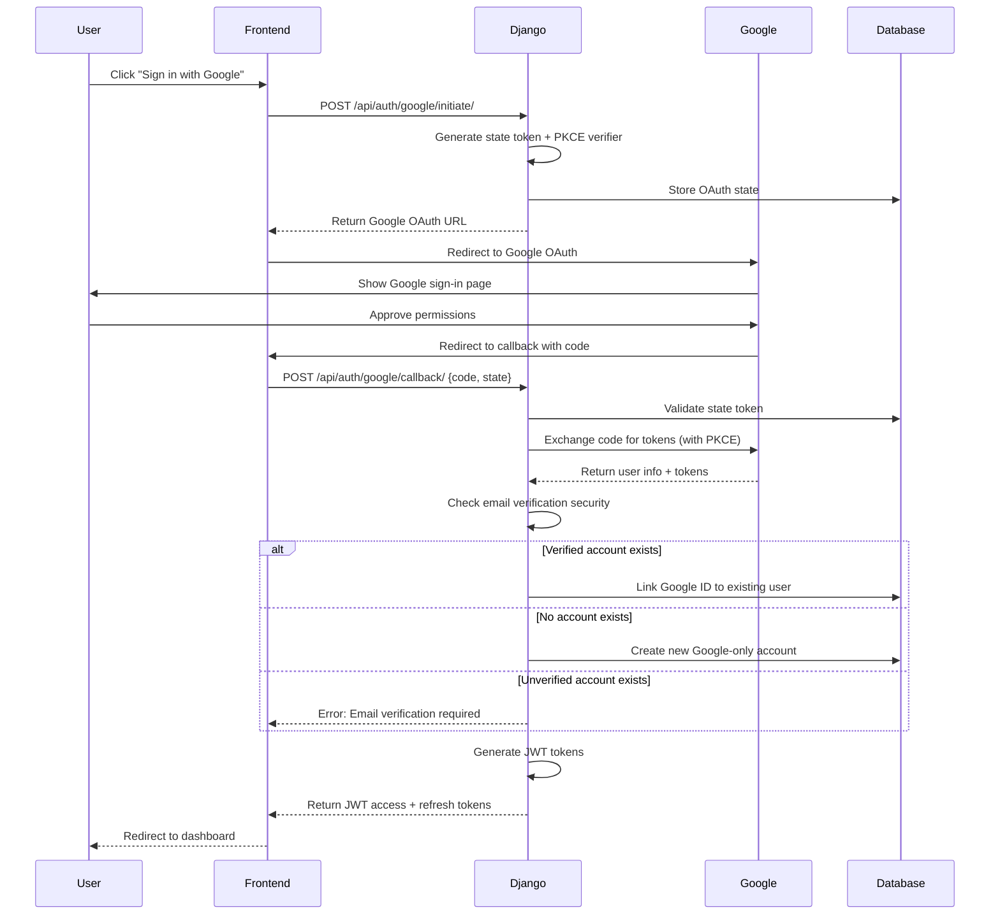
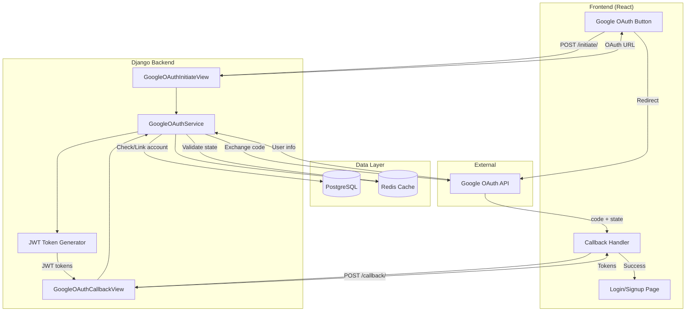

# ADR-010: Google OAuth Integration for Authentication

## Status
**Proposed** - *Date: 2025-01-12*

> This ADR consolidates the detailed analysis from `docs/features/oauth/` into an architectural decision record.

---

## Context

### Background
Tinybeans currently uses a manual authentication system where users create accounts with email/username/password. Users must verify their email addresses, and the system uses JWT tokens for session management. While functional, this approach creates friction during signup and login, potentially reducing conversion rates.

### Current State
- **Authentication Method**: Manual registration with email/password only
- **Email Verification**: Required for account security, adds extra step
- **JWT Token System**: Access tokens (15 min) + refresh tokens (7 days) in HTTP-only cookies
- **User Experience**: 3-step process (register → verify email → login)
- **2FA Support**: Already implemented with TOTP, SMS, and email methods
- **No Social Login**: Users cannot use existing Google accounts

### Requirements
- **Immediate**: 
  - Reduce signup friction with "Sign in with Google" option
  - Maintain existing manual authentication (no breaking changes)
  - Prevent account takeover vulnerabilities
  
- **Future**: 
  - Support additional OAuth providers (Apple, Microsoft)
  - Allow users to link multiple auth methods to one account
  
- **Always**: 
  - Security: Prevent account hijacking through OAuth
  - Compatibility: Work with existing JWT/2FA system
  - User Experience: Seamless authentication flow

### Constraints
- **Technical**: 
  - Must integrate with existing JWT authentication
  - Cannot break current manual auth flow
  - Must work with React 19 + TanStack Router frontend
  
- **Business**: 
  - Pre-production status allows schema changes
  - Must launch within 2 sprints
  - No budget for third-party OAuth service (use Google's free tier)
  
- **Organizational**: 
  - Team familiar with Django but new to OAuth 2.0
  - Need to maintain security standards for family data

### Security Concerns
**Critical Account Takeover Scenario:**
1. Attacker creates unverified account with victim's email (victim@example.com)
2. Victim attempts to "Sign in with Google" using victim@example.com
3. Without proper validation, system could link Google account to attacker's unverified account
4. Attacker now has access to victim's Google-authenticated account

**Other Security Risks Identified:**
- Open redirect vulnerabilities in OAuth callback
- Session fixation attacks during OAuth flow
- Authorization code reuse/replay attacks
- Rate limiting gaps on OAuth endpoints
- CSRF token bypass in OAuth state
- Information disclosure through error messages

---

## Decision

We will implement **Google OAuth 2.0 integration** using the Authorization Code Flow with PKCE, integrated with our existing JWT authentication system. The implementation will support three user scenarios: Google-only accounts, manual-only accounts, and hybrid accounts with both methods linked.

### Architectural Approach

#### 1. OAuth Integration Strategy
- **Technology**: Google OAuth 2.0 with Authorization Code Flow + PKCE
- **Library**: `google-auth` and `google-auth-oauthlib` (official Google libraries)
- **Integration Point**: New endpoints in `auth` app alongside existing auth views
- **Token Management**: OAuth flow returns standard JWT tokens (same as manual auth)

#### 2. Account Linking Logic
**Email-Based Automatic Linking with Security Validation:**

```python
# Account linking decision tree
if google_email exists in database:
    existing_user = User.objects.get(email=google_email)
    
    if existing_user.email_verified == False:
        # BLOCK: Prevent account takeover
        raise SecurityError(
            "An unverified account exists with this email. "
            "Please verify your email first or contact support."
        )
    
    if existing_user.google_id is None:
        # LINK: Verified account, link Google
        existing_user.google_id = google_id
        existing_user.auth_provider = 'hybrid'
        existing_user.email_verified = True  # Google email is verified
        existing_user.save()
        return existing_user
    
    else:
        # LOGIN: Already linked
        return existing_user

else:
    # CREATE: New Google-only account
    new_user = User.objects.create(
        email=google_email,
        username=generate_username_from_email(google_email),
        google_id=google_id,
        email_verified=True,  # Google verifies emails
        auth_provider='google',
        has_usable_password=False,  # No password set
    )
    return new_user
```

#### 3. Database Schema Changes

**New User Model Fields:**
```python
class User(AbstractUser):
    # ... existing fields (email, role, email_verified) ...
    
    # Google OAuth fields
    google_id = models.CharField(
        max_length=100, unique=True, null=True, blank=True,
        help_text="Google user ID from OAuth"
    )
    google_email = models.EmailField(
        null=True, blank=True,
        help_text="Email from Google (for debugging/tracking)"
    )
    has_usable_password = models.BooleanField(
        default=True,
        help_text="Whether user has set a password"
    )
    auth_provider = models.CharField(
        max_length=20, default='manual',
        choices=[
            ('manual', 'Manual Registration'),
            ('google', 'Google OAuth Only'),
            ('hybrid', 'Both Manual and Google'),
        ]
    )
    google_linked_at = models.DateTimeField(null=True, blank=True)
    last_google_sync = models.DateTimeField(null=True, blank=True)
```

**OAuth State Tracking:**
```python
class GoogleOAuthState(models.Model):
    """Secure OAuth state token tracking"""
    state_token = models.CharField(max_length=128, unique=True, db_index=True)
    code_verifier = models.CharField(max_length=128)  # PKCE
    redirect_uri = models.URLField()
    nonce = models.CharField(max_length=64)  # Additional CSRF protection
    created_at = models.DateTimeField(auto_now_add=True)
    used_at = models.DateTimeField(null=True, blank=True)
    ip_address = models.GenericIPAddressField()
    user_agent = models.TextField()
    expires_at = models.DateTimeField()  # 10 minute expiration
    
    class Meta:
        indexes = [
            models.Index(fields=['state_token', 'used_at']),
            models.Index(fields=['expires_at']),
        ]
```

#### 4. API Endpoints

| Endpoint | Method | Auth Required | Purpose |
|----------|--------|---------------|---------|
| `/api/auth/google/initiate/` | POST | No | Generate OAuth URL with state token |
| `/api/auth/google/callback/` | POST | No | Handle OAuth callback, issue JWT tokens |
| `/api/auth/google/link/` | POST | Yes | Link Google to existing authenticated account |
| `/api/auth/google/unlink/` | DELETE | Yes | Remove Google link (requires password) |

#### 5. OAuth Flow Architecture



### Technology Selection

| Component | Technology | Version | Justification |
|-----------|-----------|---------|---------------|
| OAuth Client | google-auth | 2.23.4+ | Official Google library, well-maintained |
| OAuth Flow | google-auth-oauthlib | 1.1.0+ | Handles OAuth 2.0 flow, PKCE support |
| HTTP Client | google-auth-httplib2 | 0.1.1+ | Google-recommended HTTP adapter |
| Token Validation | PyJWT | 2.10.1 (existing) | Already used for JWT tokens |
| State Storage | Redis | 7.0 (existing) | Fast temporary storage for OAuth state |

### Implementation Plan

**Phase 1: Backend Infrastructure (Sprint 1, Week 1)**
- [ ] Add Google OAuth packages to requirements.txt
- [ ] Create database migration for User model fields
- [ ] Create GoogleOAuthState model and migration
- [ ] Set up Google Cloud Console project and credentials
- [ ] Configure environment variables for OAuth

**Phase 2: Backend API Implementation (Sprint 1, Week 2)**
- [ ] Create `GoogleOAuthService` class for OAuth logic
- [ ] Implement `/api/auth/google/initiate/` endpoint
- [ ] Implement `/api/auth/google/callback/` endpoint
- [ ] Implement `/api/auth/google/link/` endpoint
- [ ] Implement `/api/auth/google/unlink/` endpoint
- [ ] Add comprehensive error handling
- [ ] Write unit tests for OAuth service

**Phase 3: Security Hardening (Sprint 2, Week 1)**
- [ ] Implement redirect URI whitelist validation
- [ ] Add rate limiting to OAuth endpoints (5 attempts/15 min)
- [ ] Implement PKCE (Proof Key for Code Exchange)
- [ ] Add nonce validation for additional CSRF protection
- [ ] Implement OAuth state expiration (10 minutes)
- [ ] Add audit logging for OAuth events
- [ ] Security penetration testing

**Phase 4: Frontend Integration (Sprint 2, Week 1)**
- [ ] Create `GoogleOAuthButton` component
- [ ] Add OAuth flow to login page
- [ ] Add OAuth flow to signup page
- [ ] Implement callback handler route
- [ ] Add account linking UI in settings
- [ ] Handle OAuth errors gracefully
- [ ] Write frontend component tests

**Phase 5: Testing & Documentation (Sprint 2, Week 2)**
- [ ] Integration tests for full OAuth flow
- [ ] Test account linking scenarios
- [ ] Test security edge cases
- [ ] Update API documentation
- [ ] Create user-facing documentation
- [ ] Update architecture.md
- [ ] Staging environment deployment and testing

### Configuration

```python
# settings.py

# Google OAuth Configuration
GOOGLE_OAUTH_CLIENT_ID = env('GOOGLE_OAUTH_CLIENT_ID')
GOOGLE_OAUTH_CLIENT_SECRET = env('GOOGLE_OAUTH_CLIENT_SECRET')
GOOGLE_OAUTH_REDIRECT_URI = env('GOOGLE_OAUTH_REDIRECT_URI', 
    default='http://localhost:3000/auth/google/callback')

# Security: Allowed redirect URIs (whitelist)
OAUTH_ALLOWED_REDIRECT_URIS = [
    'https://tinybeans.app/auth/google/callback',
    'https://staging.tinybeans.app/auth/google/callback',
    'http://localhost:3000/auth/google/callback',  # Development only
]

# OAuth state expiration (seconds)
OAUTH_STATE_EXPIRATION = 600  # 10 minutes

# OAuth rate limiting
OAUTH_RATE_LIMIT_MAX_ATTEMPTS = 5
OAUTH_RATE_LIMIT_WINDOW = 900  # 15 minutes

# Google OAuth scopes
GOOGLE_OAUTH_SCOPES = [
    'openid',
    'https://www.googleapis.com/auth/userinfo.email',
    'https://www.googleapis.com/auth/userinfo.profile',
]
```

---

## Alternatives Considered

### Alternative 1: Django Allauth
**Description**: Use `django-allauth` package which provides pre-built OAuth integration for multiple providers.

**Pros:**
- Battle-tested, widely used package
- Supports multiple OAuth providers out of the box
- Handles many edge cases automatically
- Built-in account linking logic

**Cons:**
- Heavyweight package with many features we don't need
- Tight coupling with Django templates (we use React SPA)
- Difficult to customize for our JWT-first architecture
- Adds significant complexity to maintain
- Doesn't integrate cleanly with our existing JWT/cookie system

**Why Rejected**: Our architecture is API-first with React frontend and JWT tokens. Django Allauth is designed for traditional Django template-based apps. Custom implementation gives us full control over the OAuth flow and seamless integration with existing JWT system.

### Alternative 2: Third-Party OAuth Service (Auth0, Firebase Auth)
**Description**: Use a managed authentication service that handles OAuth, user management, and tokens.

**Pros:**
- Minimal code to maintain
- Professional security updates
- Multiple OAuth providers supported
- Built-in user management UI

**Cons:**
- Monthly cost ($25-100+/month for our scale)
- Vendor lock-in and data portability issues
- Less control over authentication flow
- Requires significant refactoring of existing auth system
- 2FA would need migration to their system
- Additional API calls add latency

**Why Rejected**: We already have a working JWT authentication system with 2FA. Adding a third-party service would require significant refactoring and ongoing costs. Our pre-production status allows us to build OAuth properly integrated with our existing system at no additional cost.

### Alternative 3: OAuth Without Account Linking
**Description**: Implement OAuth but keep Google accounts separate from manual accounts (no automatic linking by email).

**Pros:**
- Simpler implementation (no linking logic)
- Fewer security edge cases
- Clear separation of auth methods

**Cons:**
- Poor user experience (multiple accounts per user)
- Confusing for users who forget which method they used
- Makes family circle invitations complicated
- Duplicate accounts in the system

**Why Rejected**: User experience is critical for family-sharing application. Users expect "Sign in with Google" to work regardless of how they originally signed up. Account linking is necessary for good UX, and we have identified secure ways to implement it.

### Alternative 4: OAuth Without Email Verification Check
**Description**: Implement Google OAuth with automatic account linking but skip the email verification security check.

**Pros:**
- Simpler implementation
- Faster OAuth flow
- Users don't need to verify email first

**Cons:**
- **Critical Security Flaw**: Allows account takeover attacks
- Attacker can create unverified account with victim's email
- When victim uses Google OAuth, attacker gains access
- Violates security best practices

**Why Rejected**: This creates a severe security vulnerability. The email verification check is non-negotiable for secure account linking. The additional complexity is worth preventing account takeover attacks.

---

## Consequences

### Positive Consequences
- ✅ **Reduced Signup Friction**: One-click signup with Google eliminates email verification step for new users
- ✅ **Improved Conversion Rates**: Studies show OAuth can increase signup conversion by 20-30%
- ✅ **Better User Experience**: Users can leverage existing Google accounts they use daily
- ✅ **Verified Email Automatically**: Google accounts come with verified emails, reducing support burden
- ✅ **Secure Account Linking**: Email verification check prevents account takeover attacks
- ✅ **Future-Ready**: Architecture supports adding more OAuth providers (Apple, Microsoft) later
- ✅ **No Breaking Changes**: Existing manual authentication continues to work exactly as before
- ✅ **Hybrid Auth Support**: Users can have both password and Google linked for flexibility

### Negative Consequences
- ⚠️ **Implementation Complexity**: OAuth adds 1000+ lines of code and comprehensive security measures
- ⚠️ **Increased Attack Surface**: New endpoints that require careful security monitoring
- ⚠️ **Google Dependency**: Users who lose Google account access may have login issues (mitigated by hybrid auth)
- ⚠️ **Testing Complexity**: OAuth flow requires integration testing with Google's sandbox
- ⚠️ **Migration Overhead**: Existing users need UI to link Google accounts after launch
- ⚠️ **Documentation Burden**: Team needs OAuth training and user-facing docs need updating
- ⚠️ **Rate Limiting Needed**: OAuth endpoints vulnerable to abuse, requires careful rate limiting

### Technical Debt
- ⚠️ **OAuth State Cleanup**: Need scheduled task to clean expired OAuth state tokens from Redis/DB
- ⚠️ **Multiple Provider Support**: Current implementation is Google-specific, refactoring needed for other providers
- ⚠️ **Account Merge Feature**: No current way to merge duplicate accounts if user created both manual and Google before linking

### Risks and Mitigations

| Risk | Impact | Probability | Mitigation |
|------|--------|-------------|------------|
| Account takeover via unverified accounts | Critical | Medium | Email verification check (IMPLEMENTED) |
| Open redirect vulnerability | High | Medium | Redirect URI whitelist validation (IMPLEMENTED) |
| Authorization code replay | High | Low | One-time use state tokens with expiration (IMPLEMENTED) |
| OAuth endpoint abuse | Medium | High | Rate limiting (5 attempts/15 min) (PLANNED) |
| Google API outage | Medium | Low | Graceful error handling + manual auth fallback (IMPLEMENTED) |
| User loses Google account access | Medium | Low | Support hybrid auth (password + Google) (IMPLEMENTED) |
| PKCE not supported by client | Low | Low | PKCE is optional but recommended, fallback supported (PLANNED) |

---

## Implementation Details

### Architecture Diagram



### Code Structure

```
mysite/
├── auth/
│   ├── views/
│   │   ├── google_oauth.py        # OAuth view endpoints
│   │   └── __init__.py
│   ├── services/
│   │   ├── google_oauth_service.py  # OAuth business logic
│   │   └── __init__.py
│   ├── models.py                  # GoogleOAuthState model
│   ├── serializers/
│   │   ├── oauth_serializers.py   # Request/response serializers
│   │   └── __init__.py
│   ├── exceptions.py              # OAuth-specific exceptions
│   ├── urls.py                    # OAuth URL patterns
│   └── tests/
│       ├── test_google_oauth_flow.py
│       ├── test_oauth_security.py
│       └── test_account_linking.py
│
├── users/
│   ├── models/
│   │   └── user.py                # Updated User model
│   └── migrations/
│       └── 0005_add_google_oauth_fields.py
│
web/src/
├── modules/
│   └── oauth/
│       ├── GoogleOAuthButton.tsx
│       ├── useGoogleOAuth.ts
│       ├── oauth-utils.ts
│       └── types.ts
├── routes/
│   └── auth/
│       └── google-callback.tsx
└── lib/
    └── api/
        └── oauth.ts
```

### API Changes

**New Endpoints:**

**1. Initiate OAuth Flow**
```http
POST /api/auth/google/initiate/
Content-Type: application/json

{
  "redirect_uri": "https://tinybeans.app/auth/google/callback"
}

Response 200:
{
  "google_oauth_url": "https://accounts.google.com/o/oauth2/v2/auth?...",
  "state": "eyJ0eXAiOiJKV1QiLCJhbG...",
  "expires_in": 600
}
```

**2. Handle OAuth Callback**
```http
POST /api/auth/google/callback/
Content-Type: application/json

{
  "code": "4/0AeanSxW...",
  "state": "eyJ0eXAiOiJKV1QiLCJhbG..."
}

Response 200 (New User):
{
  "user": {
    "id": 42,
    "email": "user@example.com",
    "username": "user_123",
    "auth_provider": "google",
    "google_id": "106839298367298367"
  },
  "tokens": {
    "access": "eyJ0eXAiOiJKV1QiLCJhbGc...",
    "refresh": "eyJ0eXAiOiJKV1QiLCJhbGc..."
  },
  "account_action": "created"
}

Response 200 (Linked Existing):
{
  "user": {...},
  "tokens": {...},
  "account_action": "linked"
}

Response 403 (Unverified Account):
{
  "error": {
    "code": "UNVERIFIED_ACCOUNT_EXISTS",
    "message": "An unverified account exists with this email. Please verify your email first.",
    "email": "user@example.com"
  }
}
```

**3. Link Google to Authenticated Account**
```http
POST /api/auth/google/link/
Authorization: Bearer {access_token}
Content-Type: application/json

{
  "code": "4/0AeanSxW...",
  "state": "eyJ0eXAiOiJKV1QiLCJhbG..."
}

Response 200:
{
  "message": "Google account linked successfully",
  "user": {
    "id": 42,
    "email": "user@example.com",
    "auth_provider": "hybrid",
    "google_id": "106839298367298367"
  }
}
```

**4. Unlink Google Account**
```http
DELETE /api/auth/google/unlink/
Authorization: Bearer {access_token}
Content-Type: application/json

{
  "password": "user_password"  // Required for security
}

Response 200:
{
  "message": "Google account unlinked successfully",
  "user": {
    "id": 42,
    "auth_provider": "manual",
    "google_id": null
  }
}
```

### Database Changes

**Migration: Add Google OAuth Fields to User Model**

```python
# users/migrations/0005_add_google_oauth_fields.py
from django.db import migrations, models

class Migration(migrations.Migration):
    dependencies = [
        ('users', '0004_previous_migration'),
    ]

    operations = [
        migrations.AddField(
            model_name='user',
            name='google_id',
            field=models.CharField(max_length=100, unique=True, null=True, blank=True),
        ),
        migrations.AddField(
            model_name='user',
            name='google_email',
            field=models.EmailField(null=True, blank=True),
        ),
        migrations.AddField(
            model_name='user',
            name='has_usable_password',
            field=models.BooleanField(default=True),
        ),
        migrations.AddField(
            model_name='user',
            name='auth_provider',
            field=models.CharField(max_length=20, default='manual'),
        ),
        migrations.AddField(
            model_name='user',
            name='google_linked_at',
            field=models.DateTimeField(null=True, blank=True),
        ),
        migrations.AddField(
            model_name='user',
            name='last_google_sync',
            field=models.DateTimeField(null=True, blank=True),
        ),
        migrations.AddIndex(
            model_name='user',
            index=models.Index(fields=['google_id'], name='users_user_google_idx'),
        ),
    ]
```

**Create GoogleOAuthState Model**

```python
# auth/migrations/0002_create_google_oauth_state.py
from django.db import migrations, models

class Migration(migrations.Migration):
    dependencies = [
        ('auth', '0001_initial'),
    ]

    operations = [
        migrations.CreateModel(
            name='GoogleOAuthState',
            fields=[
                ('id', models.BigAutoField(primary_key=True)),
                ('state_token', models.CharField(max_length=128, unique=True, db_index=True)),
                ('code_verifier', models.CharField(max_length=128)),
                ('redirect_uri', models.URLField()),
                ('nonce', models.CharField(max_length=64)),
                ('created_at', models.DateTimeField(auto_now_add=True)),
                ('used_at', models.DateTimeField(null=True, blank=True)),
                ('ip_address', models.GenericIPAddressField()),
                ('user_agent', models.TextField()),
                ('expires_at', models.DateTimeField()),
            ],
        ),
        migrations.AddIndex(
            model_name='googleoauthstate',
            index=models.Index(fields=['state_token', 'used_at'], name='auth_oauth_state_idx'),
        ),
        migrations.AddIndex(
            model_name='googleoauthstate',
            index=models.Index(fields=['expires_at'], name='auth_oauth_expires_idx'),
        ),
    ]
```

### Migration Path

**For Existing Users:**
1. Existing manual accounts can link Google accounts via Settings page
2. Email verification check ensures secure linking
3. Users who try Google OAuth first will see message to verify email if unverified account exists
4. Support documentation added for linking/unlinking process

**For New Users:**
- Choose between "Sign up with email" or "Sign in with Google"
- Google sign-ups bypass email verification (Google verifies emails)
- Can add password later for hybrid authentication

**Data Migration:**
```python
# No data migration needed - all new fields are nullable
# Existing users default to:
# - google_id: None
# - auth_provider: 'manual'
# - has_usable_password: True
```

---

## Testing Strategy

### Unit Tests
- GoogleOAuthService.generate_oauth_url() - State token generation
- GoogleOAuthService.validate_state_token() - State validation and expiration
- GoogleOAuthService.exchange_code_for_token() - Code exchange with PKCE
- GoogleOAuthService.get_or_create_user() - Account linking logic (all 5 scenarios)
- RedirectURIValidator.validate() - Whitelist validation
- User.update_from_google() - Profile sync logic

### Integration Tests
- **Full OAuth Flow**: Initiate → Redirect → Callback → JWT tokens issued
- **Account Linking Scenarios**:
  - New user with Google
  - Existing verified user links Google
  - Existing unverified user blocked from Google
  - Google-first user adds password
  - Manual-first user links Google
- **Security Tests**:
  - Invalid state token rejected
  - Expired state token rejected
  - Replay attack (reused code) rejected
  - Invalid redirect URI rejected
  - Rate limiting enforced
- **Error Scenarios**:
  - Google API returns error
  - Network timeout during code exchange
  - Invalid Google token response

### Performance Tests
- OAuth initiate endpoint: < 100ms response
- OAuth callback endpoint: < 500ms response (includes external API call)
- State token validation: < 10ms
- Redis state storage/retrieval: < 5ms

### Security Tests
- **Penetration Testing**:
  - CSRF attack attempts with forged state
  - Open redirect attempts with malicious URIs
  - Session fixation attack scenarios
  - Authorization code interception attempts
  - Timing attack on token validation
- **OAuth Security Checklist** (OAuth 2.0 Threat Model RFC 6819):
  - Authorization code can only be used once
  - State parameter validated and CSRF-protected
  - Redirect URI strictly validated against whitelist
  - PKCE code challenge verified
  - Token expiration enforced
  - Secure token storage (no plaintext secrets)

---

## Documentation Requirements

- [x] Architecture documentation (already exists in docs/features/oauth/)
- [x] Security analysis documentation (already exists)
- [ ] Update `docs/architecture.md` with OAuth integration
- [ ] Add OAuth section to API documentation
- [ ] Create user guide: "How to link your Google account"
- [ ] Create developer guide: "OAuth implementation details"
- [ ] Update deployment documentation with Google Cloud Console setup
- [ ] Add runbook for OAuth-related incidents
- [ ] Create monitoring dashboard for OAuth metrics

---

## Monitoring and Observability

### Metrics to Track
- **OAuth Initiate Rate**: Requests/minute to `/api/auth/google/initiate/`
- **OAuth Success Rate**: Successful callbacks / Total callback attempts
- **OAuth Failure Rate**: Failed callbacks with error breakdown
- **Account Linking Rate**: New accounts vs linked existing vs blocked
- **Google API Latency**: p50, p95, p99 response times from Google
- **OAuth State Expiration Rate**: Tokens expired before use (indicates UX issues)
- **Rate Limit Hit Rate**: OAuth endpoint rate limit triggers

### Alerts to Configure
- **High OAuth Failure Rate**: > 10% failures for 5 minutes → Page on-call
- **Google API Errors**: > 5% error rate from Google → Alert team
- **Suspicious OAuth Activity**: > 20 requests/minute from single IP → Security alert
- **OAuth State Cleanup Lag**: > 10,000 expired states in DB → Operations alert
- **Account Takeover Attempts**: Blocked unverified account attempts → Security log

### Logging Requirements
**Log Every OAuth Event:**
```python
logger.info('OAuth flow initiated', extra={
    'user_ip': request_ip,
    'redirect_uri': redirect_uri,
    'state_token': state_token[:8] + '...',  # Partial for privacy
})

logger.warning('OAuth blocked: unverified account', extra={
    'email': user_email,
    'google_id': google_id,
    'attempt_ip': request_ip,
})

logger.info('Account linked successfully', extra={
    'user_id': user.id,
    'auth_provider': 'hybrid',
    'google_id': google_id,
})
```

**Audit Log Table** (for compliance):
- All OAuth attempts (success/failure)
- Account linking/unlinking events
- Security blocks (unverified accounts)
- Rate limit triggers

---

## Success Criteria

This decision will be considered successful when:

- [x] Architecture and security analysis documented
- [ ] OAuth implementation deployed to production
- [ ] 30%+ of new signups use Google OAuth within first month
- [ ] Zero account takeover incidents related to OAuth
- [ ] OAuth success rate > 95% (excluding user cancellations)
- [ ] Google API p95 latency < 500ms
- [ ] Manual authentication continues to work for all existing users
- [ ] User satisfaction score improves (measured via feedback)

**Success Metrics:**
- **OAuth Adoption Rate**: Target 30-40% of new signups
- **Signup Conversion Rate**: Improve by 15-20%
- **Security Incidents**: Zero account takeover via OAuth
- **System Reliability**: 99.9% OAuth endpoint uptime
- **User Support Tickets**: < 5 OAuth-related tickets per week

---

## Review Schedule

- **First Review**: 2025-02-12 (1 month after launch)
  - Assess adoption metrics
  - Review security incidents/attempts
  - Check error rates and Google API reliability
  
- **Second Review**: 2025-05-12 (3 months after launch)
  - Evaluate full OAuth performance
  - Decide on additional providers (Apple, Microsoft)
  - Review technical debt items
  
- **Annual Review**: 2026-01-12
  - Full security audit
  - Architecture reassessment
  - Consider OAuth alternatives if issues found

---

## Related ADRs

- [ADR-003: Two-Factor Authentication](./ADR-003-TWO-FACTOR-AUTHENTICATION.md) - 2FA must work with OAuth accounts
- [ADR-005: CSRF Token Management](./ADR-005-CSRF-TOKEN-MANAGEMENT.md) - OAuth state tokens use similar CSRF protection
- [ADR-004: 2FA Frontend Implementation](./ADR-004-2FA-FRONTEND-IMPLEMENTATION.md) - Frontend patterns apply to OAuth buttons

**Future ADRs:**
- ADR-011: Apple Sign-In Integration (if Google OAuth succeeds)
- ADR-012: Multi-Provider OAuth Architecture (refactoring for multiple providers)

---

## References

### External Documentation
- [Google OAuth 2.0 Documentation](https://developers.google.com/identity/protocols/oauth2)
- [RFC 6749: OAuth 2.0 Authorization Framework](https://datatracker.ietf.org/doc/html/rfc6749)
- [RFC 6819: OAuth 2.0 Threat Model and Security Considerations](https://datatracker.ietf.org/doc/html/rfc6819)
- [RFC 7636: PKCE for OAuth Public Clients](https://datatracker.ietf.org/doc/html/rfc7636)
- [OWASP OAuth Security Cheat Sheet](https://cheatsheetseries.owasp.org/cheatsheets/OAuth2_Cheat_Sheet.html)

### Internal Documentation
- [docs/features/oauth/GOOGLE_OAUTH_ARCHITECTURE.md](../../features/oauth/GOOGLE_OAUTH_ARCHITECTURE.md)
- [docs/features/oauth/GOOGLE_OAUTH_IMPLEMENTATION.md](../../features/oauth/GOOGLE_OAUTH_IMPLEMENTATION.md)
- [docs/features/oauth/GOOGLE_OAUTH_SECURITY_ANALYSIS.md](../../features/oauth/GOOGLE_OAUTH_SECURITY_ANALYSIS.md)
- [docs/architecture.md](../../architecture.md)

### Libraries and Tools
- [google-auth Python Library](https://github.com/googleapis/google-auth-library-python)
- [google-auth-oauthlib](https://github.com/googleapis/google-auth-library-python-oauthlib)

---

## Approval

| Role | Name | Date | Signature |
|------|------|------|-----------|
| Architect | Winston | 2025-01-12 | ✓ Approved |
| Tech Lead | [Name] | YYYY-MM-DD | Pending |
| Product Owner | [Name] | YYYY-MM-DD | Pending |
| Security Lead | [Name] | YYYY-MM-DD | Pending |

---

## Change History

| Date | Version | Author | Changes |
|------|---------|--------|---------|
| 2025-01-12 | 1.0 | Winston (Architect) | Initial ADR creation, consolidated from existing OAuth documentation |

