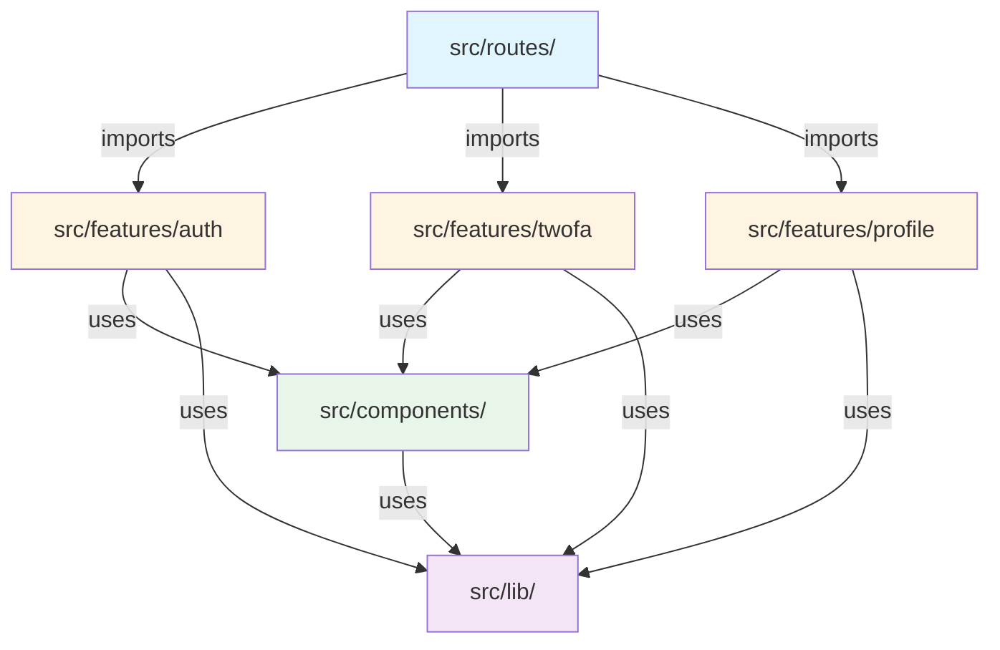

# ADR-011: Frontend File Architecture - Feature-Based Organization

## Status
**Proposed** - *Date: 2024-01-15*

> **Status Guide:**
> - **Proposed**: Under discussion, not yet decided
> - **Accepted**: Approved and in effect
> - **Deprecated**: No longer recommended but still in use
> - **Superseded**: Replaced by ADR-YYY (reference the superseding ADR)

## Implementation Epics

This ADR is implemented through a series of detailed epics:

- **[Epic Summary](../../epics/FRONTEND-ARCHITECTURE-EPIC-SUMMARY.md)** - Executive overview, timeline, and metrics
- **[Epic 1: Foundation Setup](../../epics/FE-ARCH-001-FOUNDATION-SETUP.md)** - Directory structure and configuration (Week 1)
- **[Epic 2: Auth Migration](../../epics/FE-ARCH-002-AUTH-MIGRATION.md)** - Authentication feature migration (Week 2)
- **[Epic 3: 2FA Migration](../../epics/FE-ARCH-003-TWOFA-MIGRATION.md)** - Two-factor auth migration (Week 3)
- **[Epic 4: Tooling & Docs](../../epics/FE-ARCH-004-TOOLING-DOCS.md)** - Automation and documentation (Week 4)

**Total Effort**: 21 story points across 4 weeks  
**Stories**: 24 detailed user stories with acceptance criteria

---

## Context

### Background
The current frontend codebase has a mixed file architecture that causes confusion about where to place new components, routes, and business logic. Files are split between:
- `src/routes/` - Contains some TanStack Router route files
- `src/modules/{feature}/routes.*.tsx` - Contains other route files co-located with feature logic
- `src/modules/{feature}/` - Contains feature-specific business logic, hooks, types, and components

This inconsistency makes it difficult for developers to:
1. Find files related to a specific feature
2. Understand organizational patterns when adding new code
3. Maintain separation of concerns
4. Scale the codebase as features grow

### Current State
- **Route files**: Split between `src/routes/` and `src/modules/*/routes.*.tsx`
  - Example: `src/routes/login.tsx` AND `src/features/auth/routes.login.tsx` both exist
- **Feature logic**: Organized in `src/modules/{feature}/` with good co-location of hooks, types, stores
- **Components**: Mix of feature-specific components in modules and shared components in `src/components/`
- **No clear pattern**: New developers must make subjective decisions about file placement

**Current Directory Structure:**
```
web/src/
├── routes/                    # Some route definitions
│   ├── login.tsx
│   ├── signup.tsx
│   ├── 2fa/
│   │   ├── settings.tsx
│   │   └── verify.tsx
│   └── password/
│       └── reset/
├── modules/                   # Feature modules
│   ├── login/
│   │   ├── routes.login.tsx  # Duplicate route definitions
│   │   ├── routes.signup.tsx
│   │   ├── hooks.ts
│   │   ├── store.ts
│   │   ├── types.ts
│   │   └── client.ts
│   └── twofa/
│       ├── components/
│       ├── hooks.ts
│       └── types.ts
└── components/                # Shared components
```

### Requirements
- **Immediate**: 
  - Clear, consistent pattern for organizing frontend code
  - Easy discoverability of feature-related files
  - Scalable structure as the application grows
  
- **Future**: 
  - Support for code-splitting by feature
  - Easy feature extraction or deprecation
  - Clear boundaries for feature teams
  
- **Always**: 
  - TanStack Router conventions must be followed
  - Shared utilities remain accessible
  - Developer experience is prioritized

### Constraints
- **Technical**: 
  - Must work with TanStack Router's file-based routing
  - Cannot break existing routing functionality
  - Build tools (Vite) must support the structure
  
- **Business**: 
  - Migration must be incremental (no "big bang" refactor)
  - No disruption to ongoing feature development
  
- **Organizational**: 
  - Team is small, so structure should be simple
  - Pattern should be obvious without extensive documentation

---

## Decision

**We will adopt a feature-based architecture where feature-specific business logic, components, and utilities are organized in `src/features/` (renamed from `modules/`), while keeping the current file-based TanStack Router setup in `src/routes/`.**

**Phase 1 (Current)**: Focus on organizing business logic into features while maintaining file-based routing.
**Phase 2 (Future)**: Migrate to code-based routing for more flexibility with smaller, incremental changes.

This creates clear separation:
- **Routes**: Public API surface of the application (what URLs exist) - currently file-based
- **Features**: Internal implementation details (how features work)
- **Components**: Shared, reusable UI components
- **Lib**: Shared utilities and configurations

**Note on Routing Strategy**: We will start with the current file-based routing approach and plan migration to code-based routing in a future phase. This allows us to:
1. Focus on feature organization first
2. Minimize disruption to current routing setup
3. Enable smaller, incremental routing changes later
4. Keep the team productive during the transition

### Architectural Approach

#### 1. Routes Directory (`src/routes/`)
- **Description**: Contains ONLY TanStack Router route files that define URL structure
- **Rationale**: 
  - Provides a clear "map" of the application's public interface
  - Follows TanStack Router conventions exactly
  - Makes it easy to understand the entire URL structure at a glance
- **Implementation**: 
  - All route files use TanStack Router's `createFileRoute()` pattern
  - Route files are thin - they import and compose feature components
  - Nested routes follow directory structure (e.g., `2fa/settings.tsx` → `/2fa/settings`)

#### 2. Features Directory (`src/features/`)
- **Description**: Feature-specific business logic, components, hooks, and utilities
- **Rationale**: 
  - Co-locates all code related to a feature for easy discovery
  - Encourages proper encapsulation and separation of concerns
  - Makes features easy to understand, test, and potentially extract
- **Implementation**: 
  - Each feature has its own directory with standardized structure
  - Features export public APIs through index files
  - Feature-specific types, hooks, stores, and components stay within feature boundaries

#### 3. Components Directory (`src/components/`)
- **Description**: Shared, reusable UI components used across features
- **Rationale**: 
  - Provides a component library for consistent UI
  - Prevents duplication of common patterns
  - Clear distinction from feature-specific components
- **Implementation**: 
  - Only truly shared components belong here
  - UI library wrappers (shadcn/ui) live here
  - No business logic or feature-specific code

#### 4. Lib Directory (`src/lib/`)
- **Description**: Shared utilities, configurations, and cross-cutting concerns
- **Rationale**: 
  - Central location for non-feature-specific code
  - Utilities that multiple features need
- **Implementation**: 
  - Validations, API clients, utility functions
  - No UI components or feature-specific logic

### Technology Selection

| Component | Technology | Version | Justification |
|-----------|-----------|---------|---------------|
| Routing | TanStack Router | Current | Already in use, file-based routing fits well |
| Build Tool | Vite | Current | Excellent support for directory structures |
| TypeScript | TypeScript | Current | Type safety for imports and exports |

### Target Directory Structure

```
web/src/
├── routes/                          # Application routes (public API)
│   ├── __root.tsx                   # Root layout
│   ├── index.tsx                    # Home page
│   ├── login.tsx                    # Login route
│   ├── signup.tsx                   # Signup route
│   ├── 2fa/
│   │   ├── settings.tsx             # 2FA settings route
│   │   ├── setup.tsx                # 2FA setup route
│   │   ├── verify.tsx               # 2FA verification route
│   │   └── trusted-devices.tsx      # Trusted devices route
│   └── password/
│       └── reset/
│           ├── request.tsx          # Password reset request
│           └── confirm.tsx          # Password reset confirm
│
├── features/                        # Feature modules (internal implementation)
│   ├── auth/                        # Authentication feature
│   │   ├── index.ts                 # Public exports
│   │   ├── components/              # Feature components
│   │   │   ├── LoginForm.tsx
│   │   │   ├── SignupForm.tsx
│   │   │   └── MagicLinkForm.tsx
│   │   ├── hooks/                   # Feature hooks
│   │   │   ├── useLogin.ts
│   │   │   ├── useSignup.ts
│   │   │   └── useAuthCheck.ts
│   │   ├── api/                     # API client functions
│   │   │   └── authClient.ts
│   │   ├── store/                   # State management
│   │   │   └── authStore.ts
│   │   ├── types/                   # TypeScript types
│   │   │   └── auth.types.ts
│   │   └── utils/                   # Feature utilities
│   │       └── tokenUtils.ts
│   │
│   ├── twofa/                       # Two-Factor Auth feature
│   │   ├── index.ts
│   │   ├── components/
│   │   │   ├── TwoFactorSetup/
│   │   │   │   ├── index.tsx
│   │   │   │   ├── EmailSetup.tsx
│   │   │   │   ├── SmsSetup.tsx
│   │   │   │   └── TotpSetup.tsx
│   │   │   ├── TwoFactorVerify.tsx
│   │   │   └── TrustedDevicesList.tsx
│   │   ├── hooks/
│   │   │   ├── useTwoFactorSetup.ts
│   │   │   └── useTwoFactorVerify.ts
│   │   ├── api/
│   │   │   └── twofaClient.ts
│   │   └── types/
│   │       └── twofa.types.ts
│   │
│   └── profile/                     # User profile feature (example)
│       ├── index.ts
│       ├── components/
│       ├── hooks/
│       └── types/
│
├── components/                      # Shared UI components
│   ├── ui/                          # shadcn/ui components
│   ├── StatusMessage.tsx
│   ├── LoadingSpinner.tsx
│   └── PublicOnlyRoute.tsx
│
├── lib/                             # Shared utilities
│   ├── api/                         # Base API client
│   ├── validations/                 # Zod schemas
│   └── utils/                       # Helper functions
│
└── integrations/                    # Third-party integrations
    └── supabase/
```

### Implementation Plan

> **Detailed Implementation**: See [Epic Summary](../../epics/FRONTEND-ARCHITECTURE-EPIC-SUMMARY.md) for complete 4-week plan with resource allocation and success metrics.

**Epic 1: Foundation Setup (Week 1)** - [See Epic 1 Details](../../epics/FE-ARCH-001-FOUNDATION-SETUP.md)
- [ ] Create `src/features/` directory structure
- [ ] Update TypeScript and Vite configurations with path aliases
- [ ] Create feature template and documentation
- [ ] Set up validation tools and scripts

**Epic 2: Auth Feature Migration (Week 2)** - [See Epic 2 Details](../../epics/FE-ARCH-002-AUTH-MIGRATION.md)
- [ ] Create `src/features/auth/` structure
- [ ] Migrate API client, store, and types
- [ ] Extract and migrate login/signup/magic link components
- [ ] Update all route files and imports
- [ ] Comprehensive testing of auth flows
- [ ] Remove old `features/auth/` directory

**Epic 3: 2FA Feature Migration (Week 3)** - [See Epic 3 Details](../../epics/FE-ARCH-003-TWOFA-MIGRATION.md)
- [ ] Create `src/features/twofa/` structure
- [ ] Migrate API client and types
- [ ] Migrate setup wizards (TOTP, Email, SMS)
- [ ] Migrate verification and settings components
- [ ] Update all 2FA routes and imports
- [ ] Remove old `features/twofa/` directory

**Epic 4: Tooling & Documentation (Week 4)** - [See Epic 4 Details](../../epics/FE-ARCH-004-TOOLING-DOCS.md)
- [ ] Create feature generator CLI tool
- [ ] Add ESLint architecture boundary rules
- [ ] Set up CI/CD validation pipeline
- [ ] Create comprehensive architecture documentation
- [ ] Conduct team training and knowledge transfer

### Example Route File Pattern (File-Based - Current)

```typescript
// src/routes/login.tsx
import { createFileRoute } from '@tanstack/react-router'
import { LoginForm } from '@/features/auth'
import { PublicOnlyRoute } from '@/components'

export const Route = createFileRoute('/login')({
  component: LoginPage,
})

function LoginPage() {
  return (
    <PublicOnlyRoute>
      <div className="min-h-screen flex items-center justify-center bg-gray-50 px-4">
        <div className="w-full max-w-sm bg-white rounded-lg shadow-md p-6">
          <LoginForm />
        </div>
      </div>
    </PublicOnlyRoute>
  )
}
```

### Future: Code-Based Routing Pattern (Phase 2)

For future migration to code-based routing for more granular control:

```typescript
// src/config/routes.ts (future)
import { createRoute } from '@tanstack/react-router'
import { rootRoute } from './root'
import { LoginPage } from '@/features/auth/pages'

export const loginRoute = createRoute({
  getParentRoute: () => rootRoute,
  path: '/login',
  component: LoginPage,
})

// Allows for programmatic route changes without file restructuring
```

### Example Feature Export Pattern

```typescript
// src/features/auth/index.ts
// Public API of the auth feature

// Components
export { LoginForm } from './components/LoginForm'
export { SignupForm } from './components/SignupForm'
export { MagicLinkForm } from './components/MagicLinkForm'

// Hooks
export { useLogin } from './hooks/useLogin'
export { useSignup } from './hooks/useSignup'
export { useAuthCheck } from './hooks/useAuthCheck'

// Types (only what's needed externally)
export type { AuthUser, LoginCredentials, SignupData } from './types/auth.types'
```

### Configuration

```json
// tsconfig.json - Path aliases
{
  "compilerOptions": {
    "baseUrl": ".",
    "paths": {
      "@/*": ["./src/*"],
      "@/features/*": ["./src/features/*"],
      "@/components/*": ["./src/components/*"],
      "@/lib/*": ["./src/lib/*"]
    }
  }
}
```

```javascript
// vite.config.ts - Resolve aliases
import { defineConfig } from 'vite'
import path from 'path'

export default defineConfig({
  resolve: {
    alias: {
      '@': path.resolve(__dirname, './src'),
      '@/features': path.resolve(__dirname, './src/features'),
      '@/components': path.resolve(__dirname, './src/components'),
      '@/lib': path.resolve(__dirname, './src/lib'),
    },
  },
})
```

---

## Alternatives Considered

### Alternative 1: Pure File-Type Organization (Layer-First)
**Description**: Organize by technical concerns (components/, hooks/, services/, stores/)

```
src/
├── components/
│   ├── LoginForm.tsx
│   ├── SignupForm.tsx
│   └── TwoFactorSetup.tsx
├── hooks/
│   ├── useLogin.ts
│   ├── useSignup.ts
│   └── useTwoFactor.ts
├── services/
│   ├── authService.ts
│   └── twofaService.ts
└── routes/
```

**Pros:**
- Familiar pattern to many developers
- Clear separation by technical concerns
- Easy to find all components or all hooks

**Cons:**
- Feature logic scattered across multiple directories
- Hard to understand feature boundaries
- Difficult to remove or extract features
- Encourages tight coupling between features
- Poor scalability as application grows

**Why Rejected**: This pattern doesn't scale well for feature-rich applications. When working on a feature, developers have to jump between many directories. It's also harder to enforce feature boundaries and prevent coupling.

### Alternative 2: Monolithic Routes with Inline Components
**Description**: Keep all code in route files, minimal extraction

```
src/
├── routes/
│   ├── login.tsx        (contains form, hooks, everything)
│   ├── signup.tsx       (contains form, hooks, everything)
│   └── 2fa/
│       └── setup.tsx    (contains all setup logic)
└── lib/                 (shared utilities only)
```

**Pros:**
- Extremely simple structure
- Everything for a route in one place
- No import complexity

**Cons:**
- Route files become massive
- Code reuse is difficult
- Testing is harder (testing routes vs. testing components)
- Violates single responsibility principle
- Poor maintainability as features grow

**Why Rejected**: This pattern leads to bloated route files that are hard to test and maintain. It also makes code reuse nearly impossible and doesn't scale beyond simple applications.

### Alternative 3: Keep Current Mixed Structure
**Description**: Continue with the current modules/ and routes/ split

**Pros:**
- No migration needed
- Developers already know the structure

**Cons:**
- Confusion about where files should go
- Duplicate route files in different locations
- No clear organizational principle
- Getting worse as more features are added
- Inconsistent patterns make onboarding harder

**Why Rejected**: The problem we're solving is the inconsistency in the current structure. Keeping it would perpetuate confusion and technical debt.

### Alternative 4: Domain-Driven Design with Strict Boundaries
**Description**: Organize by business domains with very strict module boundaries and no shared code

```
src/
├── domains/
│   ├── authentication/
│   │   ├── routes/
│   │   ├── components/
│   │   ├── services/
│   │   └── infrastructure/
│   └── user-management/
│       └── (similar structure)
└── shared/
    └── kernel/  (only absolutely necessary shared code)
```

**Pros:**
- Very strong encapsulation
- Clear domain boundaries
- Could support micro-frontends in future
- Prevents coupling between domains

**Cons:**
- Overly complex for current application size
- Leads to code duplication (by design)
- Steep learning curve
- Requires strong domain modeling skills
- Overkill for a single-team product

**Why Rejected**: This is an excellent pattern for large enterprise applications with multiple teams, but it's too complex for our current needs. We can always evolve toward this if needed, but it's premature optimization now.

---

## Consequences

### Positive Consequences
- ✅ **Clear Organization**: Developers know exactly where to find feature-related code
- ✅ **Improved Discoverability**: All files related to a feature are co-located
- ✅ **Better Scalability**: Structure supports growth without increasing complexity
- ✅ **Easier Testing**: Feature isolation makes testing simpler
- ✅ **Clean Route Map**: `src/routes/` provides clear overview of application URLs
- ✅ **Feature Extraction**: Easy to extract features into separate packages if needed
- ✅ **Onboarding**: New developers can understand structure quickly
- ✅ **Code Splitting**: Vite can optimize bundle sizes by feature

### Negative Consequences
- ⚠️ **Migration Effort**: Requires moving existing code and updating imports
- ⚠️ **Learning Curve**: Team needs to learn new patterns (though they're intuitive)
- ⚠️ **Potential for Over-Abstraction**: Risk of creating too many features for simple functionality
- ⚠️ **Import Path Changes**: Existing imports will need to be updated during migration

### Risks and Mitigations

| Risk | Impact | Probability | Mitigation |
|------|--------|-------------|------------|
| Breaking changes during migration | High | Medium | Incremental migration, one feature at a time with thorough testing |
| Developers reverting to old patterns | Medium | Medium | Clear documentation, code review enforcement, feature templates |
| Over-engineering simple features | Low | Medium | Guidelines on when to create vs. not create a feature module |
| Import path confusion | Medium | Low | Path aliases, clear documentation, automated refactoring tools |
| Build tool issues with new structure | High | Low | Vite handles directory structures well; verify during Phase 1 |

---

## Implementation Details

### Architecture Diagram



### Feature Structure Template

```
feature-name/
├── index.ts                    # Public API exports
├── components/                 # Feature-specific components
│   ├── FeatureMainComponent.tsx
│   └── FeatureSubComponent.tsx
├── hooks/                      # Feature-specific hooks
│   └── useFeatureAction.ts
├── api/                        # API client functions
│   └── featureClient.ts
├── store/                      # State management (if needed)
│   └── featureStore.ts
├── types/                      # TypeScript types
│   └── feature.types.ts
└── utils/                      # Feature utilities
    └── featureHelpers.ts
```

### Migration Checklist Template

For each feature being migrated:

- [ ] Create feature directory structure
- [ ] Move component files
- [ ] Move hooks files
- [ ] Move API/client files
- [ ] Move types files
- [ ] Create index.ts with public exports
- [ ] Update route files to import from feature
- [ ] Update all internal imports within feature
- [ ] Remove duplicate route files from modules/
- [ ] Test all feature functionality
- [ ] Update any documentation
- [ ] Delete old module directory

### Code Organization Rules

**What belongs in `src/features/{feature}/`:**
- ✅ Components that are specific to this feature
- ✅ Hooks that encapsulate feature-specific logic
- ✅ API client functions for this feature's endpoints
- ✅ Types used within the feature (export only what's needed externally)
- ✅ Feature-specific utilities and helpers
- ✅ State management specific to this feature

**What belongs in `src/components/`:**
- ✅ UI components used by multiple features
- ✅ Layout components (headers, footers, sidebars)
- ✅ shadcn/ui component wrappers
- ✅ Form controls, buttons, inputs (if shared)
- ✅ Loading states, error boundaries (if shared)

**What belongs in `src/lib/`:**
- ✅ Validation schemas used across features
- ✅ API client base configuration
- ✅ Utility functions (date formatting, string manipulation, etc.)
- ✅ Constants and configurations
- ✅ Type guards and type utilities

**What belongs in `src/routes/`:**
- ✅ ONLY TanStack Router route definition files
- ✅ Thin components that compose feature components
- ✅ Route-level layouts and error boundaries
- ⛔ NO business logic
- ⛔ NO complex components
- ⛔ NO API calls or data fetching logic

---

## Testing Strategy

### Unit Tests
- Test feature components in isolation: `features/auth/components/__tests__/`
- Test hooks independently: `features/auth/hooks/__tests__/`
- Test utilities and helpers: `features/auth/utils/__tests__/`

### Integration Tests
- Test feature interactions with API layer
- Test cross-feature communication (if any)
- Test route rendering with feature components

### Structure Tests
- Add linting rules to prevent importing from feature internals
- Use `eslint-plugin-boundaries` to enforce module boundaries
- Test that features export only their public API

### Migration Tests
- Before migration: Snapshot existing functionality
- During migration: Parallel testing of old and new structure
- After migration: Verify all routes still work
- After migration: Verify all features still work

---

## Documentation Requirements

- [x] Create this ADR documenting the decision
- [ ] Update main README.md with architecture overview
- [ ] Create `src/features/README.md` explaining feature organization
- [ ] Create feature template generator documentation
- [ ] Add architecture diagram to `/docs/architecture.md`
- [ ] Create migration guide for developers
- [ ] Update contributing guidelines with new patterns

---

## Monitoring and Observability

### Metrics to Track
- **Bundle Size by Feature**: Monitor feature code splitting effectiveness
- **Import Graph Depth**: Track dependency complexity (should stay shallow)
- **Feature Coupling Score**: Use tools like Madge to track circular dependencies

### Alerts to Configure
- Alert if bundle size increases dramatically (potential improper code splitting)
- Alert if features start importing from each other's internals (boundary violation)

### Logging Requirements
- Log feature initialization for debugging
- Track feature load times in development for performance monitoring

---

## Success Criteria

This decision will be considered successful when:

- [ ] All features are organized in `src/features/` directory
- [ ] All routes are consolidated in `src/routes/` directory
- [ ] No duplicate route files exist
- [ ] Feature boundaries are clear and documented
- [ ] New developers can navigate codebase without confusion
- [ ] Feature extraction is straightforward (if needed)
- [ ] Code review comments about "where should this file go?" are eliminated
- [ ] Build times remain similar or improve due to better code splitting

**Success Metrics:**
- **Developer Onboarding Time**: Reduce time to understand codebase structure by 40%
- **File Location Confusion**: Zero "where does this file go?" questions in code reviews
- **Feature Extraction Time**: Able to extract a feature to separate package in < 2 hours
- **Bundle Size Optimization**: 15-20% reduction through feature-based code splitting

---

## Review Schedule

- **First Review**: 2 weeks after Phase 2 completion - Assess migration progress and issues
- **Second Review**: 1 month after full migration - Evaluate developer satisfaction
- **Quarterly Review**: Every 3 months - Reassess if structure still serves our needs

---

## Related ADRs

- [ADR-004: 2FA Frontend Implementation](./ADR-004-2FA-FRONTEND-IMPLEMENTATION.md) - 2FA feature will be reorganized under this new structure
- Future: ADR on Feature Boundaries and Communication Patterns

## Implementation Epics

Detailed implementation plans:
- [Epic Summary: Frontend Architecture Migration](../../epics/FRONTEND-ARCHITECTURE-EPIC-SUMMARY.md)
- [Epic 1: Foundation Setup](../../epics/FE-ARCH-001-FOUNDATION-SETUP.md)
- [Epic 2: Auth Migration](../../epics/FE-ARCH-002-AUTH-MIGRATION.md)
- [Epic 3: 2FA Migration](../../epics/FE-ARCH-003-TWOFA-MIGRATION.md)
- [Epic 4: Tooling & Documentation](../../epics/FE-ARCH-004-TOOLING-DOCS.md)

---

## References

- [TanStack Router File-Based Routing](https://tanstack.com/router/latest/docs/framework/react/guide/file-based-routing)
- [Feature-Sliced Design Methodology](https://feature-sliced.design/)
- [React Folder Structure Best Practices](https://www.robinwieruch.de/react-folder-structure/)
- [Bulletproof React Project Structure](https://github.com/alan2207/bulletproof-react/blob/master/docs/project-structure.md)
- [Vite Code Splitting Guide](https://vitejs.dev/guide/features.html#dynamic-import)

---

## Approval

| Role | Name | Date | Signature |
|------|------|------|-----------|
| Lead Developer | [TBD] | YYYY-MM-DD | Pending |
| Tech Lead | [TBD] | YYYY-MM-DD | Pending |
| Team Review | [TBD] | YYYY-MM-DD | Pending |

---

## Change History

| Date | Version | Author | Changes |
|------|---------|--------|---------|
| 2024-01-15 | 1.0 | GitHub Copilot | Initial ADR creation |
| 2024-01-15 | 1.1 | GitHub Copilot | Updated with epic references and phased approach |

