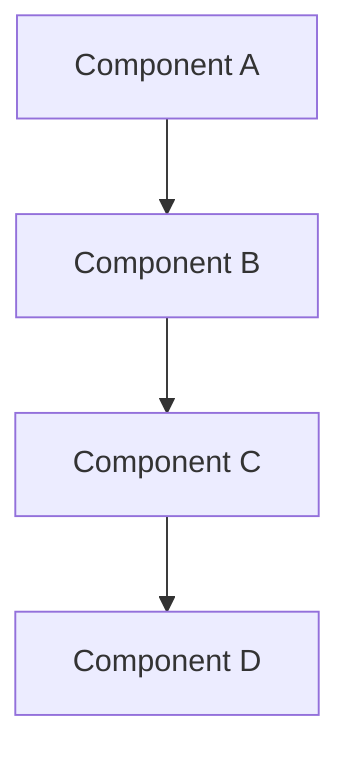

# ADR-XXX: [Decision Title]

## Status
**[Proposed | Accepted | Deprecated | Superseded]** - *Date: YYYY-MM-DD*

> **Status Guide:**
> - **Proposed**: Under discussion, not yet decided
> - **Accepted**: Approved and in effect
> - **Deprecated**: No longer recommended but still in use
> - **Superseded**: Replaced by ADR-YYY (reference the superseding ADR)

---

## Context

### Background
[Describe the situation that necessitates this decision. What is the current state? What problem are we solving?]

### Current State
- [Point about what exists today]
- [Another point about limitations or constraints]
- [Technical debt or issues with current approach]

### Requirements
- **Immediate**: [What must be addressed now]
- **Future**: [What we need to plan for]
- **Always**: [Non-negotiable requirements]

### Constraints
- **Technical**: [Technology limitations, dependencies]
- **Business**: [Budget, timeline, resource constraints]
- **Organizational**: [Team skills, existing systems]

---

## Decision

[Clearly state the decision that was made. This should be a concise statement of what will be done.]

### Architectural Approach

#### 1. [Component/Layer/Feature Name]
- **Description**: [What this component does]
- **Rationale**: [Why this approach]
- **Implementation**: [How it will be built]

#### 2. [Another Component]
- **Description**: [What this does]
- **Rationale**: [Why chosen]
- **Implementation**: [Build approach]

### Technology Selection

| Component | Technology | Version | Justification |
|-----------|-----------|---------|---------------|
| [Component 1] | [Tech choice] | [Version] | [Why this was chosen] |
| [Component 2] | [Tech choice] | [Version] | [Why this was chosen] |

### Implementation Plan

**Phase 1: [Phase Name] (Timeline)**
- [ ] [Task 1]
- [ ] [Task 2]
- [ ] [Task 3]

**Phase 2: [Phase Name] (Timeline)**
- [ ] [Task 1]
- [ ] [Task 2]

### Configuration

```python
# Example configuration
SETTING_NAME = 'value'
ANOTHER_SETTING = {
    'key': 'value',
}
```

---

## Alternatives Considered

> **Guidance:** Enumerate every viable alternative explored, even if briefly considered. For each option, capture a short description, pros, cons, and a clear rejection rationale.

### Alternative 1: [Name]
**Description**: [What this alternative would involve]

**Pros:**
- [Advantage 1]
- [Advantage 2]

**Cons:**
- [Disadvantage 1]
- [Disadvantage 2]

**Why Rejected**: [Specific reasons why this wasn't chosen]

### Alternative 2: [Name]
**Description**: [What this alternative would involve]

**Pros:**
- [Advantage]

**Cons:**
- [Disadvantage]

**Why Rejected**: [Reasons]

---

## Consequences

### Positive Consequences
- ✅ **[Benefit 1]**: [Explanation of positive impact]
- ✅ **[Benefit 2]**: [Another positive outcome]
- ✅ **[Benefit 3]**: [Technical advantage gained]

### Negative Consequences
- ⚠️ **[Trade-off 1]**: [What we give up or complexity added]
- ⚠️ **[Trade-off 2]**: [Cost or limitation introduced]
- ⚠️ **[Technical Debt]**: [Any debt incurred that should be addressed]

### Risks and Mitigations

| Risk | Impact | Probability | Mitigation |
|------|--------|-------------|------------|
| [Risk description] | High/Medium/Low | High/Medium/Low | [How to address] |
| [Another risk] | High/Medium/Low | High/Medium/Low | [Mitigation plan] |

---

## Implementation Details

### Architecture Diagram



### Code Structure

```
project/
├── module/
│   ├── component1/
│   │   ├── __init__.py
│   │   └── implementation.py
│   └── component2/
│       └── implementation.py
```

### API Changes

**New Endpoints:**
- `POST /api/endpoint/` - [Description]
- `GET /api/endpoint/{id}/` - [Description]

**Modified Endpoints:**
- `PATCH /api/existing-endpoint/` - [What changed]

### Database Changes

```sql
-- New tables
CREATE TABLE new_table (
    id SERIAL PRIMARY KEY,
    -- columns
);

-- Modified tables
ALTER TABLE existing_table
ADD COLUMN new_field VARCHAR(255);
```

### Migration Path

**For Existing Data:**
1. [Step 1 of migration]
2. [Step 2 of migration]
3. [Validation step]

**For New Features:**
- [How new functionality is enabled]

---

## Testing Strategy

### Unit Tests
- [What needs unit test coverage]
- [Specific test cases to add]

### Integration Tests
- [What integration scenarios to test]
- [Cross-system testing requirements]

### Performance Tests
- [Performance benchmarks to establish]
- [Load testing requirements]

### Security Tests
- [Security validation needed]
- [Penetration testing scenarios]

---

## Documentation Requirements

- [ ] Update architecture.md with this decision
- [ ] Add API documentation for new endpoints
- [ ] Create developer guide for new components
- [ ] Update deployment documentation
- [ ] Add runbook for operations team

---

## Monitoring and Observability

### Metrics to Track
- [Metric 1]: [What it measures and threshold]
- [Metric 2]: [What it measures and threshold]

### Alerts to Configure
- [Alert name]: [Trigger condition and action]
- [Another alert]: [When and how to respond]

### Logging Requirements
- [What events to log]
- [Log levels and structured data]

---

## Success Criteria

This decision will be considered successful when:

- [ ] [Measurable success criterion 1]
- [ ] [Measurable success criterion 2]
- [ ] [Measurable success criterion 3]
- [ ] [Performance/quality target met]

**Success Metrics:**
- [Quantitative measure 1]: [Target value]
- [Quantitative measure 2]: [Target value]

---

## Review Schedule

- **First Review**: [Date] - [What to assess]
- **Second Review**: [Date] - [What to assess]
- **Annual Review**: [Date] - [Full reassessment]

---

## Related ADRs

- [ADR-XXX: Related Decision Name](./ADR-XXX-RELATED-DECISION.md)
- [ADR-YYY: Another Related Decision](./ADR-YYY-ANOTHER-DECISION.md)

---

## References

- [External documentation link 1]
- [Technology official docs]
- [Research paper or blog post]
- [Internal discussion or RFC]

---

## Approval

| Role | Name | Date | Signature |
|------|------|------|-----------|
| Architect | [Name] | YYYY-MM-DD | ✓ Approved |
| Tech Lead | [Name] | YYYY-MM-DD | ✓ Approved |
| Product Owner | [Name] | YYYY-MM-DD | ✓ Approved |

---

## Change History

| Date | Version | Author | Changes |
|------|---------|--------|---------|
| YYYY-MM-DD | 1.0 | [Name] | Initial ADR creation |
| YYYY-MM-DD | 1.1 | [Name] | Updated after review feedback |
