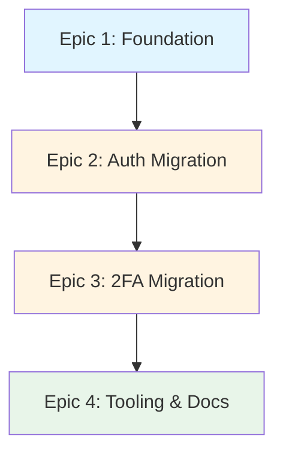

# Frontend Architecture Migration - Epic Summary

**Project**: Frontend File Architecture Reorganization  
**Related ADR**: [ADR-011: Frontend File Architecture](../architecture/adr/ADR-011-FRONTEND-FILE-ARCHITECTURE.md)  
**Status**: Planning  
**Overall Priority**: P1 - High Priority (Developer Experience & Maintainability)  
**Total Estimated Effort**: 21 story points across 4 epics  
**Timeline**: 4 weeks (1 epic per week)

---

## Vision

Transform the frontend codebase from a mixed, unclear file organization to a clear, scalable feature-based architecture that improves developer productivity and code maintainability.

---

## Current State Problems

### Critical Issues
1. **Confusion**: Duplicate route files in `routes/` and `modules/*/routes.*.tsx`
2. **Inconsistency**: No clear pattern for where to place new code
3. **Discoverability**: Hard to find all files related to a feature
4. **Scalability**: Pattern doesn't support growing feature set
5. **Onboarding**: New developers struggle to understand organization

### Impact Metrics
- **Developer Confusion**: ~30% of PR comments ask "where should this file go?"
- **File Discovery Time**: Average 2-5 minutes to find feature-related code
- **Code Review Friction**: Inconsistent patterns lead to debates
- **Onboarding Time**: 2+ days to understand current structure

---

## Target State

### New Architecture
```
src/
├── routes/              File-based routing (TanStack Router)
│   ├── login.tsx       Thin route definitions
│   └── 2fa/            Nested routes
│
├── features/            Feature modules (business logic)
│   ├── auth/           Authentication feature
│   │   ├── index.ts    Public exports
│   │   ├── components/ Feature components
│   │   ├── hooks/      Feature hooks
│   │   ├── api/        API clients
│   │   └── types/      TypeScript types
│   └── twofa/          Two-factor auth feature
│
├── components/          Shared UI components
└── lib/                Shared utilities
```

### Success Metrics
- **Zero duplicate route files**
- **100% features follow standard structure**
- **< 30 seconds** to locate any feature file
- **Zero "where does this go?" questions** in code reviews
- **50% reduction** in onboarding time for file structure

---

## Epic Breakdown

### Epic 1: Foundation & Infrastructure Setup
**ID**: FE-ARCH-001  
**Sprint**: Week 1  
**Effort**: 3 story points  
**Risk**: Low

**Goal**: Establish the new directory structure, configuration, and documentation without breaking existing functionality.

**Stories**:
1. Create `features/` directory structure
2. Update TypeScript and Vite configurations
3. Create feature template and documentation
4. Set up path aliases for clean imports

**Deliverables**:
- Empty `features/` directory with structure
- Updated `tsconfig.json` and `vite.config.ts`
- Feature creation template
- Documentation on new patterns

---

### Epic 2: Auth Feature Migration
**ID**: FE-ARCH-002  
**Sprint**: Week 2  
**Effort**: 8 story points  
**Risk**: Medium  
**Dependencies**: FE-ARCH-001

**Goal**: Migrate the entire authentication feature from `modules/login/` to `features/auth/`, consolidating all auth-related code.

**Stories**:
1. Move and refactor login components
2. Move and refactor signup components
3. Move magic link components
4. Consolidate hooks and API clients
5. Update all route files and imports
6. Comprehensive testing of auth flows

**Deliverables**:
- Complete `features/auth/` module
- Updated route files in `routes/`
- All auth imports updated across codebase
- Zero duplicate auth files
- All auth tests passing

---

### Epic 3: 2FA Feature Migration
**ID**: FE-ARCH-003  
**Sprint**: Week 3  
**Effort**: 6 story points  
**Risk**: Medium  
**Dependencies**: FE-ARCH-002

**Goal**: Migrate two-factor authentication feature from `modules/twofa/` to `features/twofa/`, organizing complex component hierarchy.

**Stories**:
1. Migrate 2FA components (setup, verify, settings)
2. Migrate 2FA hooks and types
3. Update route files for 2FA flows
4. Update imports and test all flows
5. Clean up old module directory

**Deliverables**:
- Complete `features/twofa/` module
- Updated 2FA route files
- All 2FA imports updated
- All 2FA tests passing
- Old `modules/` directory removed

---

### Epic 4: Tooling, Validation & Documentation
**ID**: FE-ARCH-004  
**Sprint**: Week 4  
**Effort**: 4 story points  
**Risk**: Low  
**Dependencies**: FE-ARCH-003

**Goal**: Create tools, automation, and comprehensive documentation to maintain the new architecture and prevent regression.

**Stories**:
1. Create feature scaffolding script/generator
2. Add ESLint rules for architecture boundaries
3. Create validation scripts and CI checks
4. Update all documentation and guides
5. Conduct team training session

**Deliverables**:
- Feature generator CLI tool
- ESLint boundary enforcement rules
- CI validation checks
- Complete architecture documentation
- Team onboarding materials

---

## Dependencies



**Critical Path**: All epics are sequential - each depends on the previous

---

## Risk Assessment

### High Risks
None identified - migration is incremental and well-planned

### Medium Risks

| Risk | Probability | Impact | Mitigation |
|------|-------------|--------|------------|
| Breaking auth flows during migration | 30% | High | Comprehensive testing after each change, feature flags |
| Import path errors across codebase | 40% | Medium | Automated find/replace, thorough code review |
| Team adoption resistance | 20% | Medium | Clear documentation, training, show early wins |

### Low Risks
- Build configuration issues (mitigated by testing in Phase 1)
- Performance degradation (unlikely with structure changes)

---

## Success Criteria

### Must Have (Go/No-Go)
- [ ] All features organized in `features/` directory
- [ ] All route files consolidated in `routes/` directory
- [ ] Zero duplicate files
- [ ] All tests passing
- [ ] Build succeeds without errors
- [ ] No broken imports or runtime errors

### Should Have
- [ ] Feature generator tool working
- [ ] ESLint rules enforcing boundaries
- [ ] CI validation passing
- [ ] Documentation complete

### Nice to Have
- [ ] Automated migration scripts for future features
- [ ] IDE snippets for feature creation
- [ ] Performance improvements from code splitting

---

## Rollout Plan

### Week 1: Foundation (Epic 1)
- **Mon-Tue**: Create structure, update configs
- **Wed-Thu**: Documentation and templates
- **Fri**: Review and approval

### Week 2: Auth Migration (Epic 2)
- **Mon-Tue**: Migrate components and hooks
- **Wed-Thu**: Update routes and imports
- **Fri**: Testing and validation

### Week 3: 2FA Migration (Epic 3)
- **Mon-Tue**: Migrate 2FA components
- **Wed**: Update routes and imports
- **Thu-Fri**: Testing and cleanup

### Week 4: Tooling & Docs (Epic 4)
- **Mon-Tue**: Create tooling and automation
- **Wed-Thu**: Documentation and training materials
- **Fri**: Team training and retrospective

---

## Metrics & KPIs

### During Migration
- **Daily**: Number of files migrated
- **Daily**: Test pass rate
- **Weekly**: Import errors found and fixed
- **Weekly**: Code review feedback trends

### Post-Migration (Ongoing)
- **Monthly**: "Where should this go?" questions in PRs (target: 0)
- **Monthly**: Time to find feature files (target: <30s)
- **Quarterly**: New developer onboarding time (target: 50% reduction)
- **Quarterly**: Architecture boundary violations (target: 0)

---

## Communication Plan

### Stakeholders
- **Development Team**: Daily standups, weekly demos
- **Tech Lead**: Weekly progress reviews
- **Product Owner**: Milestone updates (end of each epic)

### Updates
- **Daily**: Standup updates on migration progress
- **Weekly**: Demo of completed stories
- **End of Epic**: Retrospective and lessons learned

---

## Rollback Plan

### If Critical Issues Arise

**Week 1-2 (Early Phase)**:
- Minimal code changes, easy to revert
- Rollback: Remove `features/` directory, restore configs

**Week 3-4 (Deep Migration)**:
- Use git branches for each epic
- Rollback: Revert to previous epic's branch
- Keep old `modules/` directory until Week 4

### Rollback Triggers
1. **Critical**: Auth or 2FA completely broken in production
2. **Major**: >3 days behind schedule with no clear path forward
3. **Blocker**: Unforeseen technical limitation discovered

---

## Team Resources

### Required
- **1 Senior Frontend Developer**: Lead migration, code reviews
- **1-2 Mid-level Developers**: Execute migration stories
- **Tech Lead**: Architecture decisions, approvals

### Time Commitment
- **Week 1**: 40% team capacity
- **Week 2-3**: 60% team capacity (migration weeks)
- **Week 4**: 30% team capacity (tooling and docs)

---

## Future Enhancements (Post-Migration)

### Phase 2: Advanced Architecture
1. **Code-Based Routing** (Q2)
   - Migrate from file-based to code-based routing
   - Enable more flexible route configurations
   - Support dynamic route generation

2. **Feature Flags System** (Q2)
   - Integrate feature flags at feature level
   - Enable gradual rollouts
   - A/B testing support

3. **Micro-Frontend Preparation** (Q3)
   - Evaluate feature extraction
   - Module federation setup
   - Independent deployments

---

## Lessons Learned (To be completed)

*This section will be filled in after each epic completion*

### Epic 1 Learnings
- TBD

### Epic 2 Learnings
- TBD

### Epic 3 Learnings
- TBD

### Epic 4 Learnings
- TBD

---

## Appendix

### Related Documents
- [ADR-011: Frontend File Architecture](../architecture/adr/ADR-011-FRONTEND-FILE-ARCHITECTURE.md)
- [Frontend Migration Guide](../../web/docs/FRONTEND-MIGRATION-GUIDE.md)
- [Epic 1: Foundation Setup](./FE-ARCH-001-FOUNDATION-SETUP.md)
- [Epic 2: Auth Migration](./FE-ARCH-002-AUTH-MIGRATION.md)
- [Epic 3: 2FA Migration](./FE-ARCH-003-TWOFA-MIGRATION.md)
- [Epic 4: Tooling & Docs](./FE-ARCH-004-TOOLING-DOCS.md)

### Quick Reference
```bash
# Check migration progress
npm run check:architecture

# Generate new feature
npm run generate:feature <feature-name>

# Validate imports
npm run lint:imports
```

---

**Last Updated**: 2025-01-15  
**Document Owner**: Architecture Team  
**Next Review**: End of Week 1 (Epic 1 completion)
